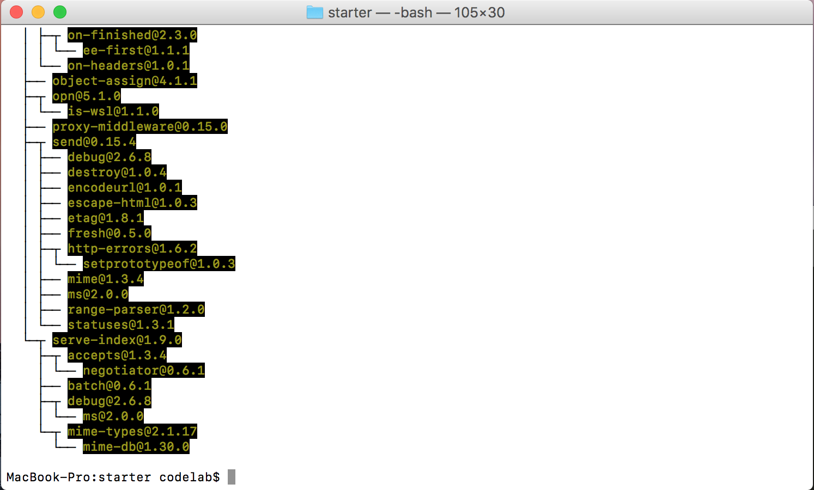
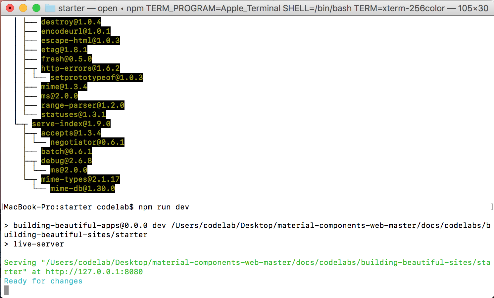
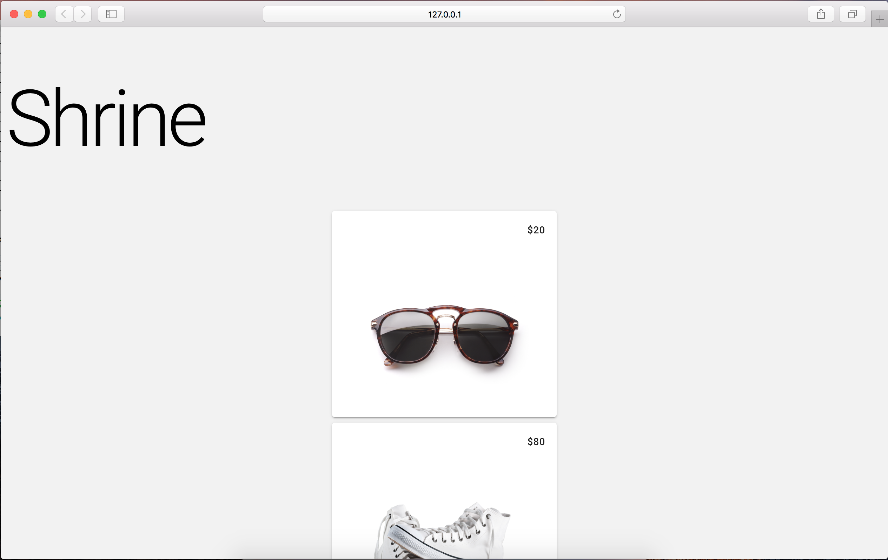

<!--docs:
title: "1. Set up your development environment"
layout: landing
section: codelabs
path: /codelabs/beautiful-sites-simplified/1-setup/
-->

<!--
This is a simplified version of Building Beautiful Sites with MDC web
edited for a non-technical audience
-->

# Set up your development environment

Duration: 5:00
 {: .codelab-duration}

## Install the project’s dependencies

From the starter directory (it should be your current directory), run `npm install`. You will see a lot of activity and at the end, the output will show a successful install.

{: .codelab-img}

## Run the starter app

Run `npm run dev` in the same directory (starter directory) in which you just ran `npm install`. The live-server will start. It watches the directory for source code changes and launches a web browser pointing to the page.

{: .codelab-img}

> If you were unable to run `npm install` or `npm run dev` successfully, stop and troubleshoot your developer environment.
{: .codelab-warning}

Voilà! Shrine is running in your browser. You can scroll through the page to see a list of product cards.

{: .codelab-img}

[Next step: Explore the starter code](./2-explore.md)
