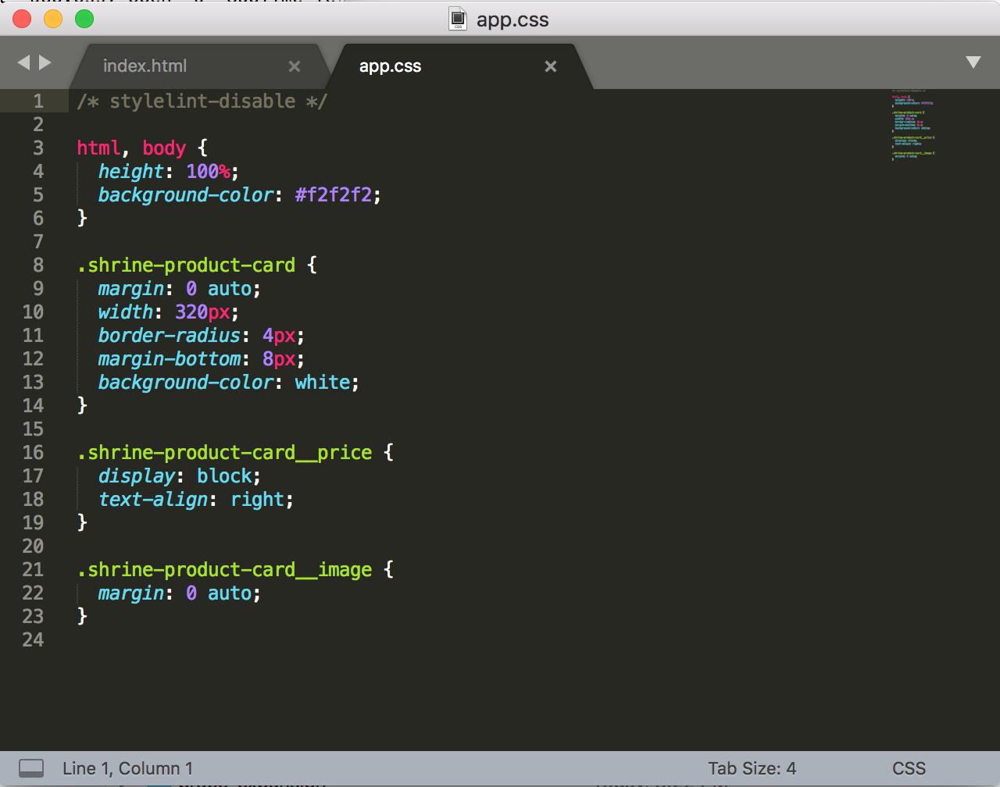

<!--docs:
title: "2. Explore the starter code"
layout: landing
section: codelabs
path: /codelabs/beautiful-sites-simplified/2-explore/
-->

<!--
This is a simplified version of Building Beautiful Sites with MDC web
edited for a non-technical audience
-->

# Explore the starter code

While far from the end result we want, our skeleton site is looking pretty good already! Let’s take a look around.

## Open index.html and app.css

In Terminal, press `command + T` to open another tab.

Then copy and paste into the new tab `open -a "Sublime Text" app.css index.html`.

Sublime should open two files: `index.html` and `app.css`.

{: .codelab-img}

Now that you’ve opened the code, let’s implement our first feature!

[Next step: Add a toolbar](./3-toolbar.md)
