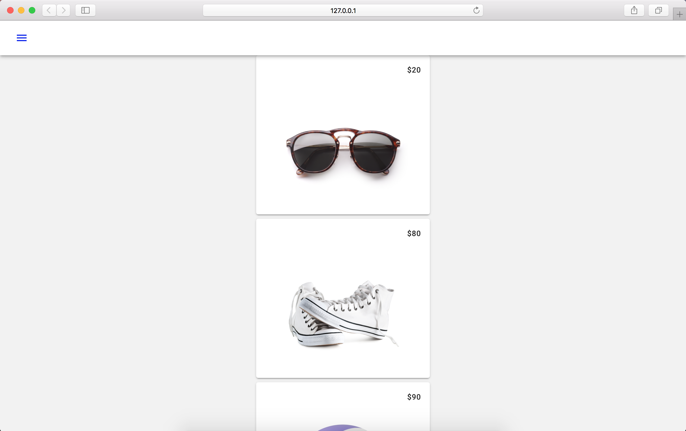

<!--docs:
title: "3. Add a toolbar"
layout: landing
section: codelabs
path: /codelabs/beautiful-sites-simplified/3-toolbar/
-->

<!--
This is a simplified version of Building Beautiful Sites with MDC web
edited for a non-technical audience
-->


# Add a Toolbar

Duration: 6:00
 {: .codelab-duration}

Let’s add a [toolbar](https://material.io/guidelines/components/toolbars.html) to better convey the branding and ensure the user always knows where they are.

It is easy to implement the toolbar using MDC-Web’s [mdc-toolbar](https://github.com/material-components/material-components-web/tree/master/packages/mdc-toolbar) component. Use a [fixed toolbar](https://github.com/material-components/material-components-web/tree/master/packages/mdc-toolbar#fixed-toolbars), because it has elevation and floats above the main content.

## Add the toolbar in index.html

In `index.html`, replace the whole file with the following:

```html
<!doctype html>
<html lang="en">
<head>
  <meta charset="utf-8">
  <meta http-equiv="x-ua-compatible" content="ie=edge">
  <title>Shrine (MDC-Web Example App)</title>
  <meta name="viewport" content="width=device-width, initial-scale=1">
  <link rel="icon" sizes="192x192" href="https://material.io/static/images/simple-lp/favicons/components-192x192.png">
  <link rel="shortcut icon" href="https://material.io/static/images/simple-lp/favicons/components-72x72.png">

  <link rel="stylesheet"
        href="https://cdnjs.cloudflare.com/ajax/libs/normalize/6.0.0/normalize.min.css">
  <link href="https://fonts.googleapis.com/css?family=Roboto:300,400,500,700" rel="stylesheet">
	<link rel="stylesheet" href="https://fonts.googleapis.com/icon?family=Material+Icons">
	<link rel="stylesheet"
        href="https://unpkg.com/material-components-web@0.9.1/dist/material-components-web.min.css">
  <link rel="stylesheet" href="app.css">
</head>
<body class="mdc-typography">
<header id="shrine-header"
        class="mdc-toolbar mdc-toolbar--fixed mdc-theme--text-primary-on-background">
  <div class="mdc-toolbar__row">
    <section class="mdc-toolbar__section mdc-toolbar__section--align-start">
			<a id="shrine-nav-icon" class="material-icons mdc-ripple-surface"
			    href="#"
			   aria-label="Click to show the navigation menu"
			   aria-controls="shrine-nav-menu"
			   data-mdc-auto-init="MDCRipple"
			   data-mdc-ripple-is-unbounded>menu</a>
      <h1 id="shrine-logo"
          class="mdc-toolbar__title"><span>Shrine</span></h1>
    </section>
  </div>
	</header>
  <main class="mdc-toolbar-fixed-adjust">
    <div class="mdc-card shrine-product-card">
      <section class="mdc-card__primary">
        <span class="mdc-card__title shrine-product-card__price">$20</span>
      </section>
      
    </div>
    <div class="mdc-card shrine-product-card">
      <section class="mdc-card__primary">
        <span class="mdc-card__title shrine-product-card__price">$80</span>
      </section>
      
    </div>
    <div class="mdc-card shrine-product-card">
      <section class="mdc-card__primary">
        <span class="mdc-card__title shrine-product-card__price">$90</span>
      </section>
      
    </div>
    <div class="mdc-card shrine-product-card">
      <section class="mdc-card__primary">
        <span class="mdc-card__title shrine-product-card__price">$30</span>
      </section>
      
    </div>
    <div class="mdc-card shrine-product-card">
      <section class="mdc-card__primary">
        <span class="mdc-card__title shrine-product-card__price">$90</span>
      </section>
      
    </div>
    <div class="mdc-card shrine-product-card">
      <section class="mdc-card__primary">
        <span class="mdc-card__title shrine-product-card__price">$30</span>
      </section>
      
    </div>
  </main>
	<script src="https://unpkg.com/material-components-web@0.9.1/dist/material-components-web.min.js">
	</script>
	<script>mdc.autoInit()</script>
</body>
</html>
```

And save.

## Change the styles

In `app.css`, find this section near the bottom:

```css
.shrine-product-card__image {
  margin: 0 auto;
}
```

Right below that, paste the following:

```css
#shrine-header {
  background-color: var(--mdc-theme-background);
  color: var(--mdc-theme-text-primary-on-background);
}

#shrine-header .mdc-toolbar__section {
  overflow: visible;
}

#shrine-logo {
  background: url(assets/logo.png) left center no-repeat;
  background-size: contain;
  width: 100%;
  height: 100%;
}

/* Hide actual text for screen readers */
#shrine-logo > span {
  position: absolute;
  width: 1px;
  height: 1px;
  padding: 0;
  margin: -1px;
  overflow: hidden;
  clip: rect(0,0,0,0);
  border: 0;
}

#shrine-nav-icon {
  width: 24px;
  height: 24px;
  margin-right: 40px;
  text-decoration: none;
}

#shrine-nav-icon:visited,
#shrine-nav-icon:active,
#shrine-nav-icon:focus {
  color: var(--mdc-theme-text-primary-on-background);
}
```

And save.

## Look at your work

The toolbar is complete! Head on over to the web browser to see your work.


{: .codelab-img}

To make the navigation icon functional, let's add a navigation drawer.

[Next step: Add a navigation drawer](./4-navigation.md)
