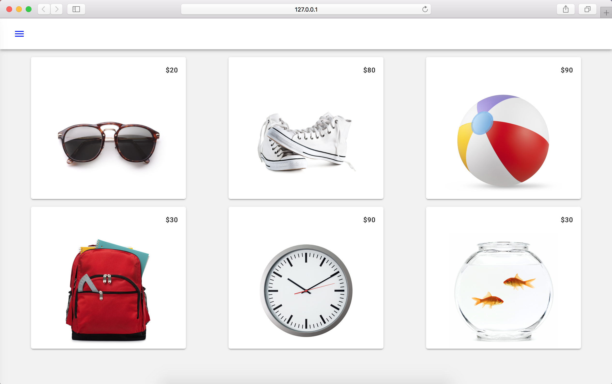

<!--docs:
title: "5. Lay out the product items"
layout: landing
section: codelabs
path: /codelabs/beautiful-sites-simplified/5-layout/
-->

<!--
This is a simplified version of Building Beautiful Sites with MDC web
edited for a non-technical audience
-->


# Lay out the product items

Duration: 4:00
 {: .codelab-duration}

The Shrine app is coming along nicely! The final step in the design is to lay out the product items to look better than a bunch of vertical cards. Use [mdc-layout-grid](https://github.com/material-components/material-components-web/tree/master/packages/mdc-layout-grid) because it implements Material Design's [Responsive UI Grid](https://material.io/guidelines/layout/responsive-ui.html#responsive-ui-grid), making product items look great across all form factors.

## Change the layout to a grid

Replace the entire `index.html` with this:

```html
<!doctype html>
<html lang="en">
<head>
  <meta charset="utf-8">
  <meta http-equiv="x-ua-compatible" content="ie=edge">
  <title>Shrine (MDC-Web Example App)</title>
  <meta name="viewport" content="width=device-width, initial-scale=1">
  <link rel="icon" sizes="192x192" href="https://material.io/static/images/simple-lp/favicons/components-192x192.png">
  <link rel="shortcut icon" href="https://material.io/static/images/simple-lp/favicons/components-72x72.png">

  <link rel="stylesheet"
        href="https://cdnjs.cloudflare.com/ajax/libs/normalize/6.0.0/normalize.min.css">
  <link href="https://fonts.googleapis.com/css?family=Roboto:300,400,500,700" rel="stylesheet">
	<link rel="stylesheet" href="https://fonts.googleapis.com/icon?family=Material+Icons">
	<link rel="stylesheet"
        href="https://unpkg.com/material-components-web@0.9.1/dist/material-components-web.min.css">
  <link rel="stylesheet" href="app.css">
</head>
<body class="mdc-typography">
<header id="shrine-header"
        class="mdc-toolbar mdc-toolbar--fixed mdc-theme--text-primary-on-background">
  <div class="mdc-toolbar__row">
    <section class="mdc-toolbar__section mdc-toolbar__section--align-start">
			<a id="shrine-nav-icon" class="material-icons mdc-ripple-surface"
			    href="#"
			   aria-label="Click to show the navigation menu"
			   aria-controls="shrine-nav-menu"
			   data-mdc-auto-init="MDCRipple"
			   data-mdc-ripple-is-unbounded>menu</a>
      <h1 id="shrine-logo"
          class="mdc-toolbar__title"><span>Shrine</span></h1>
    </section>
  </div>
	</header>
	<aside id="shrine-nav-menu" class="mdc-temporary-drawer" data-mdc-auto-init="MDCTemporaryDrawer">
	  <nav class="mdc-temporary-drawer__drawer">
	    <header class="mdc-temporary-drawer__header"></header>
	    <nav class="mdc-temporary-drawer__content mdc-list">
	      <a class="mdc-list-item" href="#">Home</a>
	      <a class="mdc-list-item" href="#">Clothing</a>
	      <a class="mdc-list-item" href="#">Popsicles</a>
	    </nav>
	  </nav>
	</aside>
	<main id="shrine-products" class="mdc-layout-grid mdc-toolbar-fixed-adjust">
    <div class="mdc-layout-grid__cell">
		<div class="mdc-card shrine-product-card">
      <section class="mdc-card__primary">
        <span class="mdc-card__title shrine-product-card__price">$20</span>
      </section>
      
    </div>
    </div>

		<div class="mdc-layout-grid__cell">
		<div class="mdc-card shrine-product-card">
      <section class="mdc-card__primary">
        <span class="mdc-card__title shrine-product-card__price">$80</span>
      </section>
      
    </div>
    </div>

		<div class="mdc-layout-grid__cell">
		<div class="mdc-card shrine-product-card">
      <section class="mdc-card__primary">
        <span class="mdc-card__title shrine-product-card__price">$90</span>
      </section>
      
    </div>
    </div>

		<div class="mdc-layout-grid__cell">
		<div class="mdc-card shrine-product-card">
      <section class="mdc-card__primary">
        <span class="mdc-card__title shrine-product-card__price">$30</span>
      </section>
      
    </div>
    </div>

		<div class="mdc-layout-grid__cell">
		<div class="mdc-card shrine-product-card">
      <section class="mdc-card__primary">
        <span class="mdc-card__title shrine-product-card__price">$90</span>
      </section>
      
    </div>
    </div>

		<div class="mdc-layout-grid__cell">
		<div class="mdc-card shrine-product-card">
      <section class="mdc-card__primary">
        <span class="mdc-card__title shrine-product-card__price">$30</span>
      </section>
      
    </div>
    </div>

  </main>
	<script src="https://unpkg.com/material-components-web@0.9.1/dist/material-components-web.min.js">
	</script>
	<script>
	  mdc.autoInit();
	  document.getElementById('shrine-nav-icon').addEventListener('click', function(evt) {
	    evt.preventDefault();
	    document.getElementById('shrine-nav-menu').MDCTemporaryDrawer.open = true;
	  });
	</script>
	</body>
</html>
```

And save.

## Add the custom styles for the Shrine product grid

Replace the entire `app.css` with this:

```css
/* stylelint-disable */

html, body {
  height: 100%;
  background-color: #f2f2f2;
}

.shrine-product-card {
  width: 320px;
  border-radius: 4px;
  margin-bottom: 8px;
  background-color: white;
}

.shrine-product-card__price {
  display: block;
  text-align: right;
}

.shrine-product-card__image {
  margin: 0 auto;
}

#shrine-header {
  background-color: var(--mdc-theme-background);
  color: var(--mdc-theme-text-primary-on-background);
}

#shrine-header .mdc-toolbar__section {
  overflow: visible;
}

#shrine-logo {
  background: url(assets/logo.png) left center no-repeat;
  background-size: contain;
  width: 100%;
  height: 100%;
}

/* Hide actual text for screen readers */
#shrine-logo > span {
  position: absolute;
  width: 1px;
  height: 1px;
  padding: 0;
  margin: -1px;
  overflow: hidden;
  clip: rect(0,0,0,0);
  border: 0;
}

#shrine-nav-icon {
  width: 24px;
  height: 24px;
  margin-right: 40px;
  text-decoration: none;
}

#shrine-nav-icon:visited,
#shrine-nav-icon:active,
#shrine-nav-icon:focus {
  color: var(--mdc-theme-text-primary-on-background);
}

#shrine-nav-menu {
  text-transform: uppercase;
  padding-left: 16px;
}

#shrine-nav-menu .mdc-temporary-drawer__drawer {
  background-color: #fafafa;
}

#shrine-nav-menu .mdc-temporary-drawer__header {
  background: url(assets/logo.png) 32px 32px no-repeat;
  background-size: 30%;
}

#shrine-nav-menu .mdc-temporary-drawer__header::before {
  padding-top: 30%;
}

#shrine-nav-menu .mdc-temporary-drawer__content {
  background: url(assets/diamond.svg) -32px bottom no-repeat;
  background-size: 50%;
}

#shrine-nav-menu .mdc-list-item {
  height: 32px;
  padding-left: 32px;
  letter-spacing: .2em;
}

#shrine-products {
  --mdc-layout-grid-gutter: 8px;
}

#shrine-products .mdc-layout-grid__cell {
  display: flex;
  justify-content: center;
}
```

And save.

## Beautiful and fast Material Design

Go check your work in the browser.

That's it! You should have a responsive product grid that looks great across all form factors.


{: .codelab-img}

Test it out yourself by resizing the browser window.

[Next step: Wrapping up](./6-wrapping-up.md)
