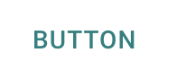
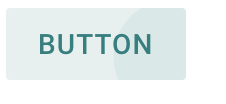

---
# This file is used by the docsite to generate the platform index page.
title: "Material Components for the Web"
layout: "homepage"
path: /
---


<ul class="benefits-list">
  <li class="benefits-list-item">
    <h3>Accurate &amp; up to date</h3>
    <p>Implement <a href="https://material.io/guidelines">Material Design</a> with pixel-perfect components, maintained by Google engineers and designers</p>
  </li>
  <li class="benefits-list-item">
    <h3>Seamless integrations</h3>
    <p>Use components designed to work in any context, allowing seamless integration with libraries like React, AngularJS, and server-side rendering</p>
  </li>
  <li class="benefits-list-item">
    <h3>Industry standards</h3>
    <p>Take advantage of components developed with minimal dependencies and tested for flexibility, accessibility, and internationalization</p>
  </li>
</ul>


# Getting Started

## Quick Start

To try Material Components for the web with minimal setup, load the CSS and JS from unpkg:

```html
https://unpkg.com/material-components-web@latest/dist/material-components-web.min.css
https://unpkg.com/material-components-web@latest/dist/material-components-web.min.js
```

Then include MDC markup...

```html
<button class="foo-button mdc-button">Button</button>
```

...and instantiate JavaScript:

```js
mdc.ripple.MDCRipple.attachTo(document.querySelector('.foo-button'));
```

However, it is highly recommended to install Material Components for the web via npm and consume its ES Modules and Sass directly. This is outlined in the steps below.

## Using MDC Web with ES Modules and Sass

> **Note:** This assumes you have Node.js and npm installed locally, and have configured webpack to compile Sass and ES Modules. See the [Getting Started Guide](getting-started.md) for pointers on how to configure webpack.

1.  {: .step-list-item } ### Install components

    Install dependencies for the components you wish to use:

    ```
    npm install @material/button @material/ripple
    ```

2.  {: .step-list-item } ### Import the stylesheet and include styles

    Import the Sass files into your application, and use Sass mixins to customize components:

    ```scss
    @import "@material/button/mdc-button";

    .foo-button {
      @include mdc-button-ink-color(teal);
      @include mdc-states(teal);
    }
    ```

    You also need to configure sass-loader to understand the `@material` imports used by MDC Web. Update your `webpack.config.js` by changing `{ loader: 'sass-loader' }` to:

    ```js
    {
      loader: 'sass-loader',
      options: {
        sassOptions: {
          includePaths: ['./node_modules']
        }
      }
    }
    ```

3.  {: .step-list-item } ### Add components

    Each component (e.g. [`@material/button`](../packages/mdc-button/README.md)) includes documentation about its required HTML structure. Update your application's HTML to include the MDC Button markup, and add the `foo-button` class to the element:

    ```html
    <button class="foo-button mdc-button">
      Button
    </button>
    ```

    Combined with the styles above, this will produce a customized Material Design button!

    

4.  {: .step-list-item } ### Add scripts and instantiate components

    Next, import the ES Module file for `@material/ripple` into your application, and initialize an `MDCRipple` with a DOM element:

    ```js
    import {MDCRipple} from '@material/ripple';
    const ripple = new MDCRipple(document.querySelector('.foo-button'));
    ```

    This will produce a Material Design ripple on the button when it is pressed!

    

5.  {: .step-list-item } ### What's next?

    <ul class="icon-list">
      <li class="icon-list-item icon-list-item--guide">
        <a href="getting-started.md">Read the Getting Started Guide</a>
      </li>
      <li class="icon-list-item icon-list-item--components">
        <a href="../packages">View the Component Documentation</a>
      </li>
      <li class="icon-list-item icon-list-item--github">
        <a href="https://github.com/material-components/material-components-web/">View the project on GitHub</a>
      </li>
    </ul>
{: .step-list }
