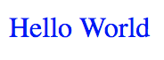

<!--docs:
title: "Getting Started"
layout: landing
section: docs
path: /docs/getting-started/
-->

# Getting Started

## Quick Start

To try Material Components for the web with minimal setup, load the CSS and JS from unpkg:

```html
https://unpkg.com/material-components-web@latest/dist/material-components-web.min.css
https://unpkg.com/material-components-web@latest/dist/material-components-web.min.js
```

Then include MDC markup...

```html
<button class="foo-button mdc-button">Button</button>
```

...and instantiate JavaScript:

```js
mdc.ripple.MDCRipple.attachTo(document.querySelector('.foo-button'));
```

However, it is highly recommended to install Material Components for the web via npm and consume its ES2015 modules and Sass directly. This is outlined in the steps below.

## Using MDC Web with ES2015 and Sass

This section walks you through how to [install MDC Web Node modules](https://www.npmjs.com/org/material), and bundle the Sass and JavaScript from those Node modules in your [webpack](https://webpack.js.org/) configuration.

> Note: This guide assumes you have Node.js and npm installed locally.

### Step 1: Webpack with Sass

We’re going to use `webpack-dev-server` to demonstrate how webpack bundles our Sass and JavaScript. First, run `npm init` to create a `package.json` file. When complete, add the `start` property to the `scripts` section.

```json
{
  "scripts": {
    "start": "webpack-dev-server"
  }
}
```

You’ll need all of these Node dependencies:
- [webpack](https://www.npmjs.com/package/webpack): Bundles Sass and JavaScript
- [webpack-dev-server](https://www.npmjs.com/package/webpack-dev-server): Development server
- [sass-loader](https://www.npmjs.com/package/sass-loader): Loads a Sass file and compiles it to CSS
- [node-sass](https://www.npmjs.com/package/node-sass): Provides binding for Node.js to Sass, peer dependency to sass-loader
- [css-loader](https://www.npmjs.com/package/css-loader): Resolves CSS @import and url() paths
- [extract-loader](https://github.com/peerigon/extract-loader): Extracts the CSS into a `.css` file
- [file-loader](https://github.com/webpack-contrib/file-loader): Serves the `.css` file as a public URL

You can install all of them by running this command:

```
npm install --save-dev webpack@3 webpack-dev-server@2 css-loader sass-loader node-sass extract-loader file-loader
```

> Note: We recommend using webpack 3, because we're still investigating using webpack 4. We also recommend you use webpack-dev-server 2, because this works with webpack 3.

In order to demonstrate how webpack bundles our Sass, you’ll need an `index.html`. This HTML file needs to include CSS. The CSS is generated by sass-loader, which compiles Sass files into CSS. The CSS is extracted into a `.css` file by extract-loader. Create this simple “hello world” `index.html`:

```html
<html>
 <head>
   <link rel="stylesheet" href="bundle.css">
 </head>
 <body>Hello World</body>
</html>
```

And create a simple Sass file called `app.scss`:

```scss
body {
  color: blue;
}
```

Then configure webpack to convert `app.scss` into `bundle.css`. For that you need a new `webpack.config.js` file:

```js
module.exports = [{
  entry: './app.scss',
  output: {
    // This is necessary for webpack to compile
    // But we never use style-bundle.js
    filename: 'style-bundle.js',
  },
  module: {
    rules: [{
      test: /\.scss$/,
      use: [
        {
          loader: 'file-loader',
          options: {
            name: 'bundle.css',
          },
        },
        { loader: 'extract-loader' },
        { loader: 'css-loader' },
        { loader: 'sass-loader' },
      ]
    }]
  },
}];
```

To test your webpack configuration, run:

```
npm start
```

And open http://localhost:8080 in a browser. You should see a blue “Hello World”.



### Step 2: Include CSS for a component

Now that you have webpack configured to compile Sass into CSS, let's include the Sass files for the Material Design button. First install the Node dependency:

```
npm install --save-dev @material/button
```

We need to tell our `app.scss` to import the Sass files for `@material/button`. We can also use Sass mixins to customize the button. Replace your “hello world” version of `app.scss` with this code:

```scss
@import "@material/button/mdc-button";

.foo-button {
  @include mdc-button-ink-color(teal);
  @include mdc-states(teal);
}
```

We also need to configure sass-loader to understand the `@material` imports used by MDC Web. Update your `webpack.config.js` by changing `{ loader: 'sass-loader' }` to:

```js
{
  loader: 'sass-loader',
  options: {
    includePaths: ['./node_modules']
  }
}
```

> Note: Configuring `includePaths` should suffice for most cases where all MDC Web packages are kept up-to-date
> together. If you encounter problems compiling Sass due to nested `node_modules` directories, see the
> [Appendix](#appendix-configuring-a-sass-importer-for-nested-node_modules) below on how to configure a custom importer
> instead.

In order to add vendor-specific styles to the Sass files, we need to configure `autoprefixer` through PostCSS.

You'll need all of these Node dependencies:
- [autoprefixer](https://www.npmjs.com/package/autoprefixer): Parses CSS and adds vendor prefixes to CSS rules
- [postcss-loader](https://github.com/postcss/postcss-loader): Loader for Webpack used in conjunction with autoprefixer

You can install all of them by running this command:

```
npm install --save-dev autoprefixer postcss-loader
```

Add `autoprefixer` at the top of your `webpack.config.js`:

```js
const autoprefixer = require('autoprefixer');
```

Then add `postcss-loader`, using `autoprefixer` as a plugin:

```js
{ loader: 'extract-loader' },
{ loader: 'css-loader' },
{ loader: 'postcss-loader',
  options: {
     plugins: () => [autoprefixer()]
  }
},
{
  loader: 'sass-loader',
  options: {
    includePaths: ['./node_modules']
  }
},
```

`@material/button` has [documentation](../packages/mdc-button/README.md) about the required HTML for a button. Update your `index.html` to include the MDC Button markup, and add the `foo-button` class to the element:

```html
<body>
  <button class="foo-button mdc-button">
    Button
  </button>
</body>
```

Now run `npm start` again and open http://localhost:8080. You should see a Material Design button!


### Step 3: Webpack with ES2015

We need to configure webpack to bundle ES2015 JavaScript into standard JavaScript, through [babel](https://babeljs.io). You’ll need all of these dependencies:

- [babel-core](https://www.npmjs.com/package/babel-core)
- [babel-loader](https://www.npmjs.com/package/babel-loader): Compiles JavaScript files using babel
- [babel-preset-es2015](https://www.npmjs.com/package/babel-preset-es2015): Preset for compiling es2015

You can install all of them by running this command:

```
npm install --save-dev babel-core babel-loader babel-preset-es2015
```

In order to demonstrate how webpack bundles our JavaScript, you’ll need to update `index.html` to include JavaScript. The JavaScript file is generated by babel-loader, which compiles ES2015 files into JavaScript. Add this script tag to `index.html`:

```html
<script src="bundle.js" async></script>
```

And create a simple ES2015 file called `app.js`:

```js
console.log('hello world');
```

Then configure webpack to convert `app.js` into `bundle.js` by modifying the following properties in the `webpack.config.js` file:

```js
// Change entry to an array for both app.js and app.scss
  entry: ['./app.scss', './app.js']

// Change output.filename to be bundle.js
  output: {
    filename: 'bundle.js',
  }

// Add the babel-loader object to the rules array after the scss loader object
...
   {
     test: /\.js$/,
     loader: 'babel-loader',
     query: {
       presets: ['es2015'],
     },
   }]

```

The final `webpack.config.js` file should look like:

```js
const autoprefixer = require('autoprefixer');

module.exports = {
  entry: ['./app.scss', './app.js'],
  output: {
    filename: 'bundle.js',
  },
  module: {
    rules: [
      {
        test: /\.scss$/,
        use: [
          {
            loader: 'file-loader',
            options: {
              name: 'bundle.css',
            },
          },
          {loader: 'extract-loader'},
          {loader: 'css-loader'},
          {loader: 'postcss-loader',
            options: {
              plugins: () => [autoprefixer()],
            },
          },
          {
            loader: 'sass-loader',
            options: {
              includePaths: ['./node_modules'],
            },
          }],
      },
      {
        test: /\.js$/,
        loader: 'babel-loader',
        query: {
          presets: ['es2015'],
        },
      }],
  },
};
```

Now run `npm start` again and open http://localhost:8080. You should see a “hello world” in the console.

### Step 4: Include JavaScript for a component

Now that you have webpack configured to compile ES2015 into JavaScript, let's include the ES2015 files from the Material Design ripple. First install the Node dependency:

```
npm install --save-dev @material/ripple
```

We need to tell our `app.js` to import the ES2015 file for `@material/ripple`. We also need to initialize an `MDCRipple` with a DOM element. Replace your “hello world” version of `app.js` with this code:

```js
import {MDCRipple} from '@material/ripple';
const ripple = new MDCRipple(document.querySelector('.foo-button'));
```

Now run `npm start` again and open http://localhost:8080. You should see a Material Design ripple on the button!


## Appendix: Configuring a Sass Importer for Nested node_modules

It is possible to end up with nested `node_modules` folders if you have dependencies on conflicting versions of
individual MDC Web packages. This may lead to errors when attempting to compile Sass with the `includePaths`
configuration shown above, since Sass is only scanning for `@material` packages under the top-level `node_modules`
directory.

Alternatively, you can implement an importer as follows, which makes use of node's module resolution algorithm to find
the dependency nearest to the file that imported it:

```js
const path = require('path');

function tryResolve_(url, sourceFilename) {
  // Put require.resolve in a try/catch to avoid node-sass failing with cryptic libsass errors
  // when the importer throws
  try {
    return require.resolve(url, {paths: [path.dirname(sourceFilename)]});
  } catch (e) {
    return '';
  }
}

function tryResolveScss(url, sourceFilename) {
  // Support omission of .scss and leading _
  const normalizedUrl = url.endsWith('.scss') ? url : `${url}.scss`;
  return tryResolve_(normalizedUrl, sourceFilename) ||
    tryResolve_(path.join(path.dirname(normalizedUrl), `_${path.basename(normalizedUrl)}`),
      sourceFilename);
}

function materialImporter(url, prev) {
  if (url.startsWith('@material')) {
    const resolved = tryResolveScss(url, prev);
    return {file: resolved || url};
  }
  return {file: url};
}
```

Then, in your `sass-loader` config:

```js
{
  loader: 'sass-loader',
  options: {
    importer: materialImporter
  },
}
```
