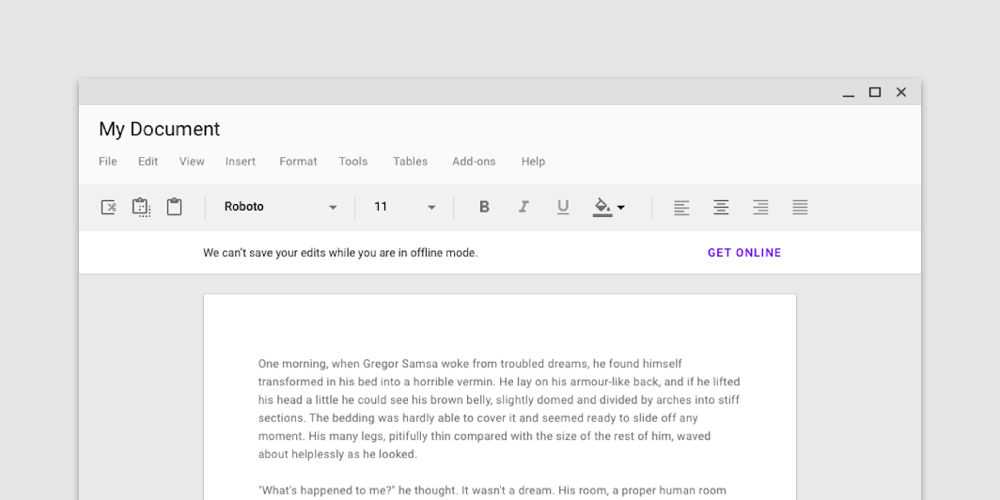

<!--docs:
title: "Banner"
layout: detail
section: components
excerpt: "A banner displays a prominent message and related optional actions."
iconId: banner
path: /catalog/banners/
-->

# Banner

A banner displays a prominent message and related optional actions.



**Contents**

* [Using banners](#using-banners)
* [Banners](#banners)
* [API](#api)
* [Usage within web frameworks](#usage-within-web-frameworks)

## Using banners

A banner displays an important, succinct message, and provides actions for users to address (or dismiss the banner). It requires a user action to be dismissed.

Banners should be displayed at the top of the screen, below a top app bar. They’re persistent and nonmodal, allowing the user to either ignore them or interact with them at any time. Only one banner should be shown at a time.

### Installing banners

```
npm install @material/banner
```

### Styles

```scss
@use "@material/banner/styles";
```

### JavaScript instantiation

```js
import {MDCBanner} from '@material/banner';
const banner = new MDCBanner(document.querySelector('.mdc-banner'));
```

> See [Importing the JS component](../../docs/importing-js.md) for more information on how to import JavaScript.

## Banners

### Banner example

```html
<div class="mdc-banner" role="banner">
  <div class="mdc-banner__content"
       role="status"
       aria-live="assertive">
    <div class="mdc-banner__graphic-text-wrapper">
      <div class="mdc-banner__text">
        There was a problem processing a transaction on your credit card.
      </div>
    </div>
    <div class="mdc-banner__actions">
      <button type="button" class="mdc-button mdc-banner__primary-action">
        <div class="mdc-button__ripple"></div>
        <div class="mdc-button__label">Fix it</div>
      </button>
    </div>
  </div>
</div>
```

### Variants

#### Centered

By default, banners are positioned as leading.

They can optionally be displayed centered by adding the `mdc-banner--centered` modifier class to the root element:

```html
<div class="mdc-banner mdc-banner--centered">
  ...
</div>
```

Alternatively, you can call the `position-centered` mixin from Sass:

```scss
.my-banner {
  @include banner.position-centered;
}
```

#### Fixed Banner

When used below top app bars, banners should remain fixed at the top of the screen. This can be done by adding the `mdc-banner__fixed` wrapper element around the content element:

```html
<div class="mdc-banner" role="banner">
  <div class="mdc-banner__fixed">
    <div class="mdc-banner__content"
         role="status"
         aria-live="assertive">
      <div class="mdc-banner__graphic-text-wrapper">
        <div class="mdc-banner__text">
          There was a problem processing a transaction on your credit card.
        </div>
      </div>
      <div class="mdc-banner__actions">
        <button type="button" class="mdc-button mdc-banner__primary-action">
          <div class="mdc-button__ripple"></div>
          <div class="mdc-button__label">Fix it</div>
        </button>
      </div>
    </div>
  </div>
</div>
```

#### Banner with graphic

Images can help communicate a banner’s message.

```html
<div class="mdc-banner" role="banner">
  <div class="mdc-banner__content"
       role="status"
       aria-live="assertive">
    <div class="mdc-banner__graphic-text-wrapper">
      <div class="mdc-banner__graphic" role="img" alt=""><i class="material-icons mdc-banner__icon">error_outline</i></div>
      <div class="mdc-banner__text">
        There was a problem processing a transaction on your credit card.
      </div>
    </div>
    <div class="mdc-banner__actions">
      <button type="button" class="mdc-button mdc-banner__primary-action">
        <div class="mdc-button__ripple"></div>
        <div class="mdc-button__label">Fix it</div>
      </button>
    </div>
  </div>
</div>
```

#### Banner with two actions

Banners may have one or two low-emphasis text buttons.

```html
<div class="mdc-banner" role="banner">
  <div class="mdc-banner__content"
       role="status"
       aria-live="assertive">
    <div class="mdc-banner__graphic-text-wrapper">
      <div class="mdc-banner__text">
        There was a problem processing a transaction on your credit card.
      </div>
    </div>
    <div class="mdc-banner__actions">
      <button type="button" class="mdc-button mdc-banner__secondary-action">
        <div class="mdc-button__ripple"></div>
        <div class="mdc-button__label">Learn more</div>
      </button>
      <button type="button" class="mdc-button mdc-banner__primary-action">
        <div class="mdc-button__ripple"></div>
        <div class="mdc-button__label">Fix it</div>
      </button>
    </div>
  </div>
</div>
```


#### Mobile Stacked

On mobile view, banners with long text should have their action(s) be positioned _below_ the text instead of alongside it. This can be accomplished by adding the `mdc-banner--mobile-stacked` modifier class to the root element:

```html
<div class="mdc-banner mdc-banner--mobile-stacked">
  ...
</div>
```

Alternatively, you can call the `mobile-stacked` mixin from Sass:

```scss
.my-banner {
  @include banner.mobile-stacked;
}
```

## API

### Sass mixins

Access to theme mixins require importing the banner's theme style module.

```scss
@use "@material/banner";
```

Mixin | Description
--- | ---
`fill-color($color)` | Sets the fill color of the banner.
`text-color($color)` | Sets the color of the banners's text.
`divider-color($color)` | Sets the color of the banner's divider.
`min-width($min-width, $mobile-breakpoint)` | Sets the `min-width` of the banner content on tablet/desktop devices. On mobile, the width is automatically set to 100%.
`max-width($max-width)` | Sets the `max-width` of the banner content.
`position-centered()` | Sets the banner content to centered instead of leading.
`z-index($z-index)` | Sets the z-index of the banner.

### `MDCBanner` events

Event name | `event.detail` | Description
--- | --- | ---
`MDCBanner:closing` | `MDCBannerCloseEventDetail` | Indicates when the banner begins its closing animation.
`MDCBanner:closed` | `MDCBannerCloseEventDetail` | Indicates when the banner finishes its closing animation.
`MDCBanner:opening` | `{}` | Indicates when the banner begins its opening animation.
`MDCBanner:opened` | `{}` | Indicates when the banner finishes its opening animation.

### `MDCBanner` Methods

Method Signature | Description
--- | ---
`open() => void` | Opens the banner.
`close(reason: CloseReason) => void` | Closes the banner, with the specified action indicating why it was closed.
`isOpen() => boolean` | Returns whether the banner is open.
`getText() => string` | Gets the text of the banner.
`setText(text: string) => void` | Sets the text of the banner.
`getPrimaryActionText() => string` | Gets the banner's primary action text.
`setPrimaryActionText(actionButtonText: string) => void` | Sets the banner's primary action text.
`getSecondaryActionText() => string|null` | Gets the banner's secondary action text. Returns null if the banner has no secondary action.
`setSecondaryActionText(actionButtonText: string) => void` | Sets the banner's secondary action text.
`layout() => void` | Recalculates layout. With height being calculated dynamically recommended to call on window `resize` events.

### Usage Within Frameworks

If you are using a JavaScript framework, such as React or Angular, you can create a banner for your framework. Depending on your needs, you can use the _Simple Approach: Wrapping MDC Web Vanilla Components_, or the _Advanced Approach: Using Foundations and Adapters_. Please follow the instructions [here](../../docs/integrating-into-frameworks.md).

See [MDCBannerAdapter](./adapter.ts) and [MDCBannerFoundation](./foundation.ts) for up-to-date code documentation of banner foundation APIs.
