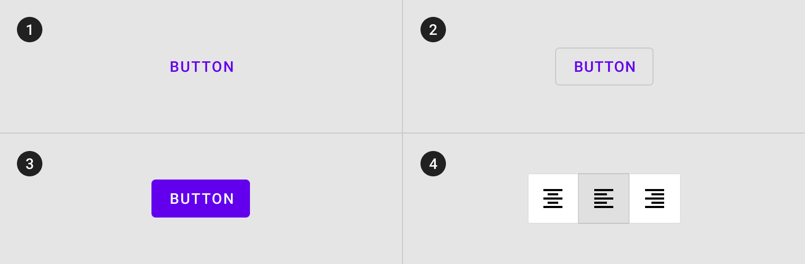
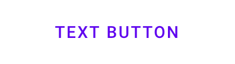
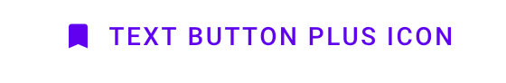
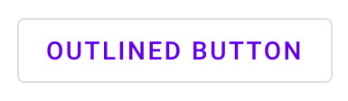
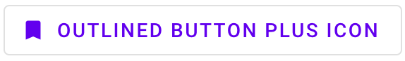
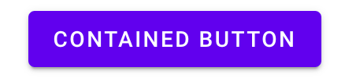
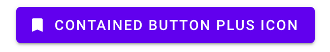
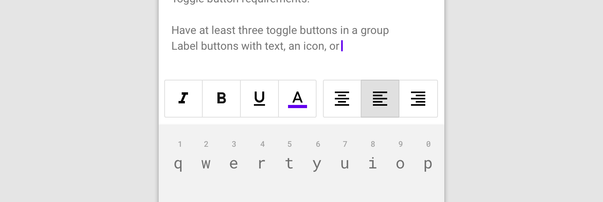
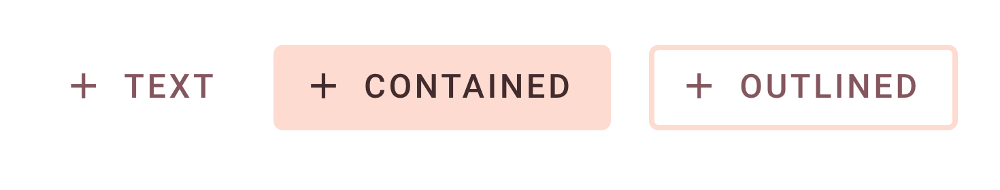

<!--docs:
title: "Buttons"
layout: detail
section: components
excerpt: "Web Buttons"
iconId: button
path: /catalog/buttons/
-->

# Buttons

<!--<div class="article__asset">
  <a class="article__asset-link test-increment1"
     href="https://material-components.github.io/material-components-web-catalog/#/component/button">
    
  </a>
</div>-->

[Buttons](https://material.io/components/buttons/) allow users to take actions, and make choices, with a single tap.

There are four types of buttons:

1. [Text button](#text-button)
2. [Outlined button](#outlined-button)
3. [Contained button](#contained-button)
4. [Toggle button](#toggle-button)

**Note: Toggle buttons are implemented using the `mdc-icon-button` component.
For more information, see the [`mdc-icon-button` page](../mdc-icon-button).**



## Using buttons

### Installation

```
npm install @material/button
```

### Styles

```scss
@use "@material/button";

@include button.core-styles;
```

### JavaScript instantiation

The button will work without JavaScript, but you can enhance it to have a ripple effect by instantiating `MDCRipple` on the root element. See [MDC Ripple](../mdc-ripple) for details.

```js
import {MDCRipple} from '@material/ripple';

const buttonRipple = new MDCRipple(document.querySelector('.mdc-button'));
```

**Note: See [Importing the JS component](../../docs/importing-js.md) for more information on how to import JavaScript.**

### Making buttons accessible

Material Design spec advises that touch targets should be at least 48 x 48 px.
To meet this requirement, add the following to your button:

```html
<div class="mdc-touch-target-wrapper">
  <button class="mdc-button mdc-button--touch">
    <div class="mdc-button__ripple"></div>
    <span class="mdc-button__label">My Accessible Button</span>
    <div class="mdc-button__touch"></div>
  </button>
</div>
```
**Note: The outer `mdc-touch-target-wrapper` element is only necessary if you want to avoid potentially overlapping touch targets on adjacent elements (due to collapsing margins).**

## Text button

[Text buttons](https://material.io/components/buttons/#text-button) are typically used for less-pronounced actions, including those located in dialogs and cards. In cards, text buttons help maintain an emphasis on card content.

### Text button example



```html
 <button class="mdc-button">
   <div class="mdc-button__ripple"></div>
   <span class="mdc-button__label">Text Button</span>
</button>
```

<b>Text button with icon example</b>



```html
<button class="mdc-button">
  <div class="mdc-button__ripple"></div>
  <i class="material-icons mdc-button__icon" aria-hidden="true"
    >bookmark</i
  >
  <span class="mdc-button__label">Text Button plus icon</span>
</button>

```

## Outlined button

[Outlined buttons](https://material.io/components/buttons/#outlined-button) are medium-emphasis buttons. They contain actions that are important, but aren’t the primary action in an app.

### Outlined button example



```html
<button class="mdc-button--outlined">
  <div class="mdc-button__ripple"></div>
  <span class="mdc-button__label">Outlined Button</span>
</button>
```

<b>Outlined button with icon example</b>



```html
<button class="mdc-button mdc-button--outlined">
  <div class="mdc-button__ripple"></div>
  <i class="material-icons mdc-button__icon" aria-hidden="true">bookmark</i>
  <span class="mdc-button__label">Outlined Button plus Icon</span>
</button>
```

## Contained button

[Contained buttons](https://material.io/components/buttons/#contained-button) are high-emphasis, distinguished by their use of elevation and fill. They contain actions that are primary to your app.

#### Contained button example



```html
<button class="mdc-button--raised">
  <span class="mdc-button__label">Contained Button</span>
</button>
```

**Note**: `mdc-button--raised` is applied for a contained button with elevation,
and `mdc-button--unelevated` is applied for a contained button flush with the surface.

<b>Contained button with icon example</b>



```html
<button class="mdc-button mdc-button--raised">
  <div class="mdc-button__ripple"></div>
  <i class="material-icons mdc-button__icon" aria-hidden="true"
    >bookmark</i
  >
  <span class="mdc-button__label">Contained Button plus Icon</span>
</button>
```

## Toggle button

[Toggle buttons](https://material.io/components/buttons/#toggle-button) can be used to select from a group of choices.

There are two types of toggle buttons:

* [Toggle button](#toggle-button)
* [Icon](#icon)



MDC Web currently does not support toggle button groups.

### Icon

Icons can be used as toggle buttons when they allow selection, or deselection, of a single choice, such as marking an item as a favorite.

For more details, see the [`mdc-icon-button` page](../mdc-icon-button).

## Other Variants

### Icon

We recommend using [Material Icons](https://material.io/tools/icons/) from Google Fonts:

```html
<head>
  <link rel="stylesheet" href="https://fonts.googleapis.com/icon?family=Material+Icons">
</head>
```

However, you can also use SVG, [Font Awesome](https://fontawesome.com/), or any other icon library you wish.

To add an icon, add an element with the `mdc-button__icon` class inside the button element and set the attribute `aria-hidden="true"`. The icon is set to 18px to meet legibility requirements.

```html
<button class="mdc-button">
  <div class="mdc-button__ripple"></div>
  <i class="material-icons mdc-button__icon" aria-hidden="true">favorite</i>
  <span class="mdc-button__label">Button</span>
</button>
```

It's also possible to use an SVG icon:

```html
<button class="mdc-button">
  <div class="mdc-button__ripple"></div>
  <svg class="mdc-button__icon" aria-hidden="true" xmlns="http://www.w3.org/2000/svg" viewBox="...">
  ...
  </svg>
  <span class="mdc-button__label">Button</span>
</button>
```

#### Trailing Icon

Certain icons make more sense to appear after the button's text label rather than before. This can be accomplished by
putting the icon markup _after_ the `mdc-button__label` element.

```html
<button class="mdc-button">
  <div class="mdc-button__ripple"></div>
  <span class="mdc-button__label">Button</span>
  <i class="material-icons mdc-button__icon" aria-hidden="true">favorite</i>
</button>
```

> _NOTE_: The `mdc-button__label` element is _required_ in order for the trailing icon to be styled appropriately.

### Disabled

To disable a button, add the `disabled` attribute directly to the `<button>`, or set the `disabled` attribute on the `<fieldset>` containing the button.
Disabled buttons cannot be interacted with and have no visual interaction effect.

```html
<button class="mdc-button" disabled>
  <div class="mdc-button__ripple"></div>
  <span class="mdc-button__label">Button</span>
</button>
```

## Button theming example

The following example shows text, contained, and outlined button types with Material Theming.



### Theming with Sass variables

Before importing any MDC Web modules, set the theme colors in your Sass file:

```scss
@use "@material/theme" with (
  $primary: #FEDBD0,
  $on-primary: #442C2E
);
```

In this case we also want to customize the label color of the text and outlined
buttons, to fulfill color contrast requirements. Assuming that you've applied
the `custom-text-button` and `custom-outlined-button` classes to your buttons:

```scss
@use "@material/button";

@include button.core-styles;

.custom-text-button,
.custom-outlined-button {
  @include button.ink-color(#84565E);
}
```

### Theming with CSS custom properties

If you want to customize the theme for buttons without changing the theme
across the app, you can also use CSS custom properties:

```scss
@use "@material/button";

@include button.core-styles;

.custom-text-button,
.custom-outlined-button {
  --mdc-theme-primary: #FEDBD0;
  --mdc-theme-on-primary: #442C2E;

  @include button.ink-color(#84565E);
}
```

For a more information on theming in general, see
[this page](../../docs/theming.md).

## API

### CSS classes

CSS Class | Description
--- | ---
`mdc-button` | Mandatory. Defaults to a text button that is flush with the surface.
`mdc-button__ripple` | Mandatory. Indicates the element which shows the ripple styling.
`mdc-button--raised` | Optional. Styles a contained button that is elevated above the surface.
`mdc-button--unelevated` | Optional. Styles a contained button that is flush with the surface.
`mdc-button--outlined` | Optional. Styles an outlined button that is flush with the surface.
`mdc-button__label` | Recommended.\* Indicates the element containing the button's text label.
`mdc-button__icon` | Optional. Indicates the element containing the button's icon.

 **_NOTE_: The `mdc-button__label` element is required for buttons with a trailing icon, but it is currently optional for
 buttons with no icon or a leading icon. In the latter cases, it is acceptable for the text label to simply exist
 directly within the `mdc-button` element.<br>
 However, the `mdc-button__label` class may become mandatory for all cases in the future so we recommended to
 always include it.**

### Sass mixins

To customize a button's color and properties, you can use the following mixins.

#### Basic Sass mixins

MDC Button uses [MDC Theme](../mdc-theme)'s `primary` color by default. Use the following mixins to customize it.

Mixin | Description
--- | ---
`filled-accessible($container-fill-color)` | Sets the container fill color for a contained (_raised_ or _unelevated_) button, and updates the button's ink, icon, and ripple colors to meet accessibility standards

#### Advanced Sass mixins

These mixins will override the color of the container, ink, outline or ripple. It is up to you to ensure your button meets accessibility standards.

Mixin | Description
--- | ---
`container-fill-color($color)` | Sets the container fill color to the given color for an enabled button.
`disabled-container-fill-color($color)` | Sets the container fill color to the given color for a disabled button.
`icon-color($color)` | Sets the icon color to the given color for an enabled button.
`disabled-icon-color($color)` | Sets the icon color to the given color for a disabled button.
`ink-color($color)` | Sets the ink color to the given color for an enabled button, and sets the icon color to the given color unless `icon-color` is also used.
`disabled-ink-color($color)` | Sets the ink color to the given color for a disabled button, and sets the icon color to the given color unless `icon-color` is also used.
`density($density-scale)` | Sets density scale for button. Supported density scale values (`-3`, `-2`, `-1`, `0`).
`height($height)` | Sets custom height for button.
`shape-radius($radius, $density-scale, $rtl-reflexive)` | Sets rounded shape to button with given radius size. `$density-scale` is only required when `$radius` value is in percentage unit, defaults to `$density-default-scale`. Set `$rtl-reflexive` to true to flip radius values in RTL context, defaults to false.
`horizontal-padding($padding)` | Sets horizontal padding to the given number.
`outline-color($color)` | Sets the outline color to the given color for an enabled button.
`disabled-outline-color($color)` | Sets the outline color to the given color for a disabled button.
`outline-width($width, $padding)` | Sets the outline width to the given number (defaults to 2px) and adjusts padding accordingly. `$padding` is only required in cases where `$horizontal-padding` is also included with a custom value.
