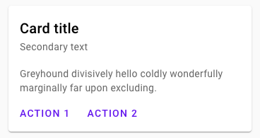

<!--docs:
title: "Cards"
layout: detail
section: components
excerpt: "Cards contain content and actions about a single subject."
iconId: card
path: /catalog/cards/
-->

# Cards

[Cards](https://material.io/components/cards/) contain content and actions about a single subject.

For additional information, see the [API](#api).



## Using cards

### Installation

```
npm install @material/card
```

### Styles

```css
@use "@material/card";

@include card.core-styles;
```

In order to remain general-purpose and support e.g. images spanning the full width of the card, MDC Card does not
include padding styles on the root element. When adding free-form text content to cards, padding should be set to
`16px`:

```css
.my-card-content {
  padding: 16px;
}
```

**Note: MDC Card's predefined classes for content areas (e.g. `mdc-card__actions`) take care of their own padding.**

By default, cards expand horizontally to fill all available space, and vertically to fit their contents.
If you'd like to maintain a consistent width and height across cards, you'll need to set it in your styles:

```css
.my-card {
  height: 350px;
  width: 350px;
}
```

You can also place cards within layout containers, such as [MDC Layout Grid](../mdc-layout-grid)
or CSS Flexbox or Grid.

### JavaScript

MDC Card itself does not require JavaScript. However, if you place interactive components inside your cards,
you may want to instantiate ripples or other components. For example:

```js
import {MDCRipple} from '@material/ripple';

const selector = '.mdc-button, .mdc-icon-button, .mdc-card__primary-action';
const ripples = [].map.call(document.querySelectorAll(selector), function(el) {
  return new MDCRipple(el);
});
```

**Note: If your card includes any [icon button toggles](../mdc-icon-button#icon-button-toggle), you will want to
instantiate `MDCIconButtonToggle` instead of `MDCRipple`.**

## Card

### Card example

```html
<div class="mdc-card">
  <!-- ... content ... -->
</div>
```

**Note: MDC Card is designed to accommodate a wide variety of use cases. See the [Card Contents](#card-contents) section for information on helpers for specific types of content within cards.**

## Other variants

### Outlined card


By default, cards are elevated with no outline. You can render unelevated, outlined cards instead by adding the
`mdc-card--outlined` modifier class.

```html
<div class="mdc-card mdc-card--outlined">
  <!-- ... content ... -->
</div>
```

### Card contents

MDC Card can be used for a wide variety of use cases, but it includes styles for a few common ones.

#### Primary action

If a majority of the card (or even the entire card) should be actionable, you can add the `mdc-card__primary-action`
class to the region to give it MDC Ripple styles. You should also assign `tabindex="0"` to ensure it can also be
interacted with via keyboard.

```html
<div class="mdc-card">
  <div class="mdc-card__primary-action" tabindex="0">
    <!-- content within actionable area -->
    <div class="mdc-card__ripple"></div>
  </div>
  <!-- ... content ... -->
</div>
```

**Note: We recommend avoiding adding other actionable items within `mdc-card__primary-action`, due to the overlapping
effect of multiple nested elements with ripple and states applied at once.**

#### Rich media

This area is used for showing rich media in cards, and optionally as a container. Use the `mdc-card__media` CSS class
and the [optional modifier classes](#css-classes).

```html
<div class="my-card__media mdc-card__media--16-9">
  <div class="mdc-card__media-content">Title</div>
</div>
```

```css
.my-card__media {
  background-image: url("pretty.jpg");
}
```

#### Actions

This area is used to show different actions the user can take, typically at the bottom of a card.
It's often used with [buttons](../mdc-button):

```html
<div class="mdc-card__actions">
  <button class="mdc-button mdc-card__action mdc-card__action--button">
    <div class="mdc-button__ripple"></div>
    <span class="mdc-button__label">Action 1</span>
  </button>
  <button class="mdc-button mdc-card__action mdc-card__action--button">
    <div class="mdc-button__ripple"></div>
    <span class="mdc-button__label">Action 2</span>
  </button>
</div>
```

It can also be used with [icon buttons](../mdc-icon-button):

```html
<div class="mdc-card__actions">
  <button class="mdc-icon-button mdc-card__action mdc-card__action--icon"
     aria-pressed="false"
     aria-label="Add to favorites"
     title="Add to favorites">
   <i class="material-icons mdc-icon-button__icon mdc-icon-button__icon--on">favorite</i>
   <i class="material-icons mdc-icon-button__icon">favorite_border</i>
  </button>
  <button class="material-icons mdc-icon-button mdc-card__action mdc-card__action--icon" title="Share">share</button>
  <button class="material-icons mdc-icon-button mdc-card__action mdc-card__action--icon" title="More options">more_vert</button>
</div>
```

Be sure to include the `mdc-card__action` class on every action for correct positioning. In addition, _button_ icons
should use the `mdc-card__action--button` class, and _icon_ actions should use the `mdc-card__action--icon` class.

To have a single action button take up the entire width of the action row, use the `--full-bleed` modifier on the row:

```html
<div class="mdc-card__actions mdc-card__actions--full-bleed">
  <a class="mdc-button mdc-card__action mdc-card__action--button" href="#">
    <div class="mdc-button__ripple"></div>
    <span class="mdc-button__label">All Business Headlines</span>
    <i class="material-icons mdc-button__icon" aria-hidden="true">arrow_forward</i>
  </a>
</div>
```

To display buttons _and_ icons in the same row, wrap them in `mdc-card__action-buttons` and `mdc-card__action-icons`
elements:

```html
<div class="mdc-card__actions">
  <div class="mdc-card__action-buttons">
    <button class="mdc-button mdc-card__action mdc-card__action--button">
      <div class="mdc-button__ripple"></div>
      <span class="mdc-button__label">Read</span>
    </button>
    <button class="mdc-button mdc-card__action mdc-card__action--button">
      <div class="mdc-button__ripple"></div>
      <span class="mdc-button__label">Bookmark</span>
    </button>
  </div>
  <div class="mdc-card__action-icons">
   <button class="material-icons mdc-icon-button mdc-card__action mdc-card__action--icon" title="Share">share</button>
    <button class="material-icons mdc-icon-button mdc-card__action mdc-card__action--icon" title="More options">more_vert</button>
  </div>
</div>
```

##### Icons

We recommend using [Material Icons](https://material.io/tools/icons/) from Google Fonts:

```html
<head>
  <link rel="stylesheet" href="https://fonts.googleapis.com/icon?family=Material+Icons">
</head>
```

However, you can also use SVG, [Font Awesome](https://fontawesome.com/), or any other icon library you wish.

#### Combined example

The following is an example incorporating all of the above elements:

```html
<div class="mdc-card">
  <div class="mdc-card__primary-action">
    <div class="mdc-card__media mdc-card__media--square">
      <div class="mdc-card__media-content">Title</div>
    </div>
    <!-- ... additional primary action content ... -->
    <div class="mdc-card__ripple"></div>
  </div>
  <div class="mdc-card__actions">
    <div class="mdc-card__action-buttons">
      <button class="mdc-button mdc-card__action mdc-card__action--button">
        <div class="mdc-button__ripple"></div>
        <span class="mdc-button__label">Action 1</span>
      </button>
      <button class="mdc-button mdc-card__action mdc-card__action--button">
        <div class="mdc-button__ripple"></div>
        <span class="mdc-button__label">Action 2</span>
      </button>
    </div>
    <div class="mdc-card__action-icons">
      <button class="material-icons mdc-icon-button mdc-card__action mdc-card__action--icon" title="Share">share</button>
      <button class="material-icons mdc-icon-button mdc-card__action mdc-card__action--icon" title="More options">more_vert</button>
    </div>
  </div>
</div>
```

#### Non-semantic content

It can occasionally be useful to add non-semantic elements to a card. For instance, some implementations might do this to add an overlay layer.

In this case, it's important to delineate between semantic (real) content and non-semantic content added by the implementation. To achieve this, simply wrap the semantic content in an `mdc-card__content` element. The non-semantic content can remain at the card's top level:

```html
<div class="mdc-card">
  <div class="mdc-card__content">
    <!-- ... semantic content ... -->
  </div>
  <!-- ... non-semantic content ... -->
</div>
```

## API

### CSS classes

CSS Class | Description
--- | ---
`mdc-card` | Mandatory. The main card element.
`mdc-card--outlined` | Optional. Removes the shadow and displays a hairline outline instead.
`mdc-card__primary-action` | Optional. The main tappable area of the card. Typically contains most (or all) card content _except_ `mdc-card__actions`. Only applicable to cards that have a primary action that the main surface should trigger.
`mdc-card__ripple` | Optional. The element that shows the ripple styling. This is mandatory if `mdc-card__primary-action` is used. Only applicable to cards that have a primary action that the main surface should trigger.
`mdc-card__media` | Optional. Media area that displays a custom `background-image` with `background-size: cover`.
`mdc-card__media--square` | Optional. Automatically scales the media area's height to equal its width.
`mdc-card__media--16-9` | Optional. Automatically scales the media area's height according to its width, maintaining a 16:9 aspect ratio.
`mdc-card__media-content` | Optional. An absolutely-positioned box the same size as the media area, for displaying a title or icon on top of the `background-image`.
`mdc-card__actions` | Optional. Row containing action buttons and/or icons.
`mdc-card__actions--full-bleed` | Optional. Removes the action area's padding and causes its only child (an `mdc-card__action` element) to consume 100% of the action area's width.
`mdc-card__action-buttons` | Optional. A group of action buttons, displayed on the left side of the card (in LTR), adjacent to `mdc-card__action-icons`.
`mdc-card__action-icons` | Optional. A group of supplemental action icons, displayed on the right side of the card (in LTR), adjacent to `__action-buttons`.
`mdc-card__action` | Optional. An individual action button or icon.
`mdc-card__action--button` | Optional. An action button with text.
`mdc-card__action--icon` | Optional. An action icon with no text. We recommend using [Material Icons](https://material.io/tools/icons/) from Google Fonts.
`mdc-card__content` | Optional. Used to delineate the card's semantic contents from any non-semantic elements (e.g., those used to implement an overlay).

### Sass mixins

Mixin | Description
--- | ---
`fill-color($color)` | Sets the fill color of a card.
`outline($color, $thickness)` | Sets the color and thickness of a card's outline (but does _not_ remove its shadow).
`shape-radius($radius, $rtl-reflexive)` | Sets the rounded shape to card with given radius size. Set `$rtl-reflexive` to true to flip radius values in RTL context, defaults to false.
`media-aspect-ratio($x, $y)` | Maintains the given aspect ratio on a `mdc-card__media` subelement by dynamically scaling its height relative to its width.
