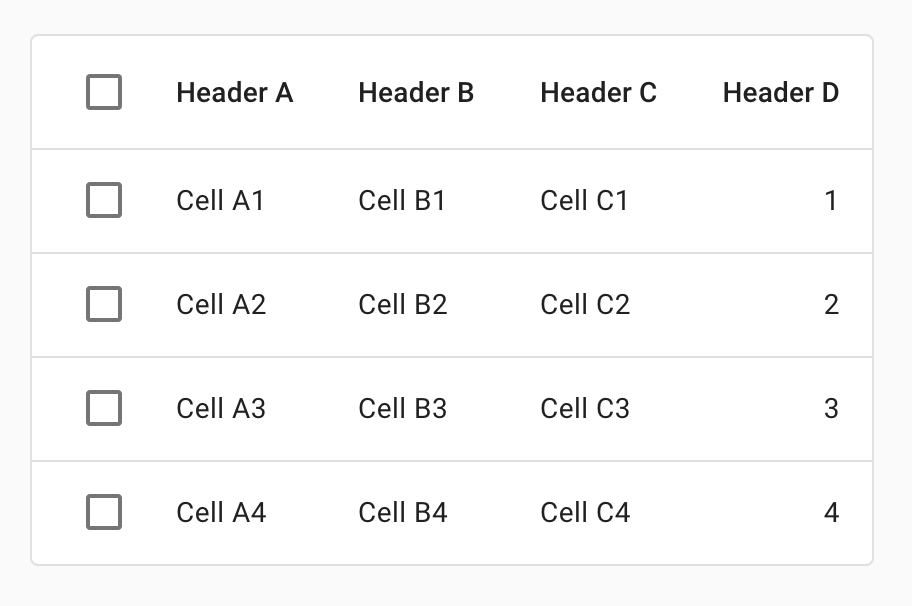

<!--docs:
title: "Data Tables"
layout: detail
section: components
excerpt: "Data tables display information in a grid-like format of rows and columns."
iconId: data_table
path: /catalog/data-tables/
-->

# Data tables

[Data tables](https://material.io/components/data-tables/#) display sets of data across rows and columns.



## Using data tables

Data tables display information in a grid-like format of rows and columns. They organize information in a way that’s easy to scan, so that users can look for patterns and insights.

Data tables can contain:

* Interactive components (such as chips, buttons, or menus)
* Non-interactive elements (such as badges)
* Tools to query and manipulate data

### Installation

```
npm install @material/data-table
```

### Styles

```scss
@use "@material/checkbox"; // Required only for data table with row selection.
@use "@material/data-table";

@include checkbox.core-styles;
@include data-table.core-styles;
```

**Note: Styles for any components you intend to include within data-table (e.g. Checkboxes, Buttons etc.) must be
loaded.**

### JavaScript instantiation

```js
import {MDCDataTable} from '@material/data-table';
const dataTable = new MDCDataTable(document.querySelector('.mdc-data-table'));
```

> See [Importing the JS component](../../docs/importing-js.md) for more information on how to import JavaScript.

> Instantiating `MDCDataTable` component is only required to add interactions for example, row selection.

MDC Data Table component auto instantiates `MDCCheckbox` for header row checkbox and all row checkboxes. Make sure to set required class names to instantiate checkbox component. We suggest to use `layout` API when rows are added or removed from data table to register new checkbox components.

### Making data tables accessible

Please refer to the [WAI-ARIA Authoring Practices for table](https://www.w3.org/TR/wai-aria-practices-1.1/#table) for the ARIA recommended role, states and properties required for table element.

## Data tables

```html
<div class="mdc-data-table">
  <div class="mdc-data-table__table-container">
    <table class="mdc-data-table__table" aria-label="Dessert calories">
      <thead>
        <tr class="mdc-data-table__header-row">
          <th class="mdc-data-table__header-cell" role="columnheader" scope="col">Dessert</th>
          <th class="mdc-data-table__header-cell mdc-data-table__header-cell--numeric" role="columnheader" scope="col">Carbs (g)</th>
          <th class="mdc-data-table__header-cell mdc-data-table__header-cell--numeric" role="columnheader" scope="col">Protein (g)</th>
          <th class="mdc-data-table__header-cell" role="columnheader" scope="col">Comments</th>
        </tr>
      </thead>
      <tbody class="mdc-data-table__content">
        <tr class="mdc-data-table__row">
          <th class="mdc-data-table__cell" scope="row">Frozen yogurt</th>
          <td class="mdc-data-table__cell mdc-data-table__cell--numeric">24</td>
          <td class="mdc-data-table__cell mdc-data-table__cell--numeric">4.0</td>
          <td class="mdc-data-table__cell">Super tasty</td>
        </tr>
        <tr class="mdc-data-table__row">
          <th class="mdc-data-table__cell" scope="row">Ice cream sandwich</th>
          <td class="mdc-data-table__cell mdc-data-table__cell--numeric">37</td>
          <td class="mdc-data-table__cell mdc-data-table__cell--numeric">4.33333333333</td>
          <td class="mdc-data-table__cell">I like ice cream more</td>
        </tr>
        <tr class="mdc-data-table__row">
          <th class="mdc-data-table__cell" scope="row">Eclair</th>
          <td class="mdc-data-table__cell mdc-data-table__cell--numeric">24</td>
          <td class="mdc-data-table__cell mdc-data-table__cell--numeric">6.0</td>
          <td class="mdc-data-table__cell">New filing flavor</td>
        </tr>
      </tbody>
    </table>
  </div>
</div>
```

## Other variants

### Data table with row selection

```html
<div class="mdc-data-table">
  <div class="mdc-data-table__table-container">
    <table class="mdc-data-table__table" aria-label="Dessert calories">
      <thead>
        <tr class="mdc-data-table__header-row">
          <th class="mdc-data-table__header-cell mdc-data-table__header-cell--checkbox" role="columnheader" scope="col">
            <div class="mdc-checkbox mdc-data-table__header-row-checkbox mdc-checkbox--selected">
              <input type="checkbox" class="mdc-checkbox__native-control" aria-label="Toggle all rows"/>
              <div class="mdc-checkbox__background">
                <svg class="mdc-checkbox__checkmark" viewBox="0 0 24 24">
                  <path class="mdc-checkbox__checkmark-path" fill="none" d="M1.73,12.91 8.1,19.28 22.79,4.59" />
                </svg>
                <div class="mdc-checkbox__mixedmark"></div>
              </div>
              <div class="mdc-checkbox__ripple"></div>
            </div>
          </th>
          <th class="mdc-data-table__header-cell" role="columnheader" scope="col">Signal name</th>
          <th class="mdc-data-table__header-cell" role="columnheader" scope="col">Status</th>
          <th class="mdc-data-table__header-cell" role="columnheader" scope="col">Severity</th>
          <th class="mdc-data-table__header-cell" role="columnheader" scope="col">Stage</th>
          <th class="mdc-data-table__header-cell mdc-data-table__header-cell--numeric" role="columnheader" scope="col">Time</th>
          <th class="mdc-data-table__header-cell" role="columnheader" scope="col">Roles</th>
        </tr>
      </thead>
      <tbody class="mdc-data-table__content">
        <tr data-row-id="u0" class="mdc-data-table__row">
          <td class="mdc-data-table__cell mdc-data-table__cell--checkbox">
            <div class="mdc-checkbox mdc-data-table__row-checkbox">
              <input type="checkbox" class="mdc-checkbox__native-control" aria-labelledby="u0"/>
              <div class="mdc-checkbox__background">
                <svg class="mdc-checkbox__checkmark" viewBox="0 0 24 24">
                  <path class="mdc-checkbox__checkmark-path" fill="none" d="M1.73,12.91 8.1,19.28 22.79,4.59" />
                </svg>
                <div class="mdc-checkbox__mixedmark"></div>
              </div>
              <div class="mdc-checkbox__ripple"></div>
            </div>
          </td>
          <th class="mdc-data-table__cell" scope="row" id="u0">Arcus watch slowdown</th>
          <td class="mdc-data-table__cell">Online</td>
          <td class="mdc-data-table__cell">Medium</td>
          <td class="mdc-data-table__cell">Triaged</td>
          <td class="mdc-data-table__cell mdc-data-table__cell--numeric">0:33</td>
          <td class="mdc-data-table__cell">Allison Brie</td>
        </tr>
        <tr data-row-id="u1" class="mdc-data-table__row mdc-data-table__row--selected" aria-selected="true">
          <td class="mdc-data-table__cell mdc-data-table__cell--checkbox">
            <div class="mdc-checkbox mdc-data-table__row-checkbox mdc-checkbox--selected">
              <input type="checkbox" class="mdc-checkbox__native-control" checked aria-labelledby="u1"/>
              <div class="mdc-checkbox__background">
                <svg class="mdc-checkbox__checkmark" viewBox="0 0 24 24">
                  <path class="mdc-checkbox__checkmark-path" fill="none" d="M1.73,12.91 8.1,19.28 22.79,4.59" />
                </svg>
                <div class="mdc-checkbox__mixedmark"></div>
              </div>
              <div class="mdc-checkbox__ripple"></div>
            </div>
          </td>
          <th class="mdc-data-table__cell" scope="row" id="u1">monarch: prod shared ares-managed-features-provider-heavy</th>
          <td class="mdc-data-table__cell">Offline</td>
          <td class="mdc-data-table__cell">Huge</td>
          <td class="mdc-data-table__cell">Triaged</td>
          <td class="mdc-data-table__cell mdc-data-table__cell--numeric">0:33</td>
          <td class="mdc-data-table__cell">Brie Larson</td>
        </tr>
        <tr data-row-id="u2" class="mdc-data-table__row mdc-data-table__row--selected" aria-selected="true">
          <td class="mdc-data-table__cell mdc-data-table__cell--checkbox">
            <div class="mdc-checkbox mdc-data-table__row-checkbox mdc-checkbox--selected">
              <input type="checkbox" class="mdc-checkbox__native-control" checked aria-labelledby="u2"/>
              <div class="mdc-checkbox__background">
                <svg class="mdc-checkbox__checkmark" viewBox="0 0 24 24">
                  <path class="mdc-checkbox__checkmark-path" fill="none" d="M1.73,12.91 8.1,19.28 22.79,4.59" />
                </svg>
                <div class="mdc-checkbox__mixedmark"></div>
              </div>
              <div class="mdc-checkbox__ripple"></div>
            </div>
          </td>
          <th class="mdc-data-table__cell" scope="row" id="u2">monarch: prod shared ares-managed-features-provider-heavy</th>
          <td class="mdc-data-table__cell">Online</td>
          <td class="mdc-data-table__cell">Minor</td>
          <td class="mdc-data-table__cell">Not triaged</td>
          <td class="mdc-data-table__cell mdc-data-table__cell--numeric">0:33</td>
          <td class="mdc-data-table__cell">Jeremy Lake</td>
        </tr>
        <tr data-row-id="u3" class="mdc-data-table__row">
          <td class="mdc-data-table__cell mdc-data-table__cell--checkbox">
            <div class="mdc-checkbox mdc-data-table__row-checkbox">
              <input type="checkbox" class="mdc-checkbox__native-control" aria-labelledby="u3"/>
              <div class="mdc-checkbox__background">
                <svg class="mdc-checkbox__checkmark" viewBox="0 0 24 24">
                  <path class="mdc-checkbox__checkmark-path" fill="none" d="M1.73,12.91 8.1,19.28 22.79,4.59" />
                </svg>
                <div class="mdc-checkbox__mixedmark"></div>
              </div>
              <div class="mdc-checkbox__ripple"></div>
            </div>
          </td>
          <th class="mdc-data-table__cell" scope="row" id="u3">Arcus watch slowdown</th>
          <td class="mdc-data-table__cell">Online</td>
          <td class="mdc-data-table__cell">Negligible</td>
          <td class="mdc-data-table__cell">Triaged</td>
          <td class="mdc-data-table__cell mdc-data-table__cell--numeric">0:33</td>
          <td class="mdc-data-table__cell">Angelina Cheng</td>
        </tr>
      </tbody>
    </table>
  </div>
</div>
```

## Style customization

### CSS classes

CSS Class | Description
--- | ---
`mdc-data-table` | Mandatory. The root DOM element containing `table` and other supporting elements.
`mdc-data-table__table-container` | Mandatory. Container of Table element. Used for horizontal overflowing of table content.
`mdc-data-table__table` | Mandatory. Table element. Added to `table` HTML tag.
`mdc-data-table__header-row` | Mandatory. Table header row element. Added to `thead > tr` HTML tag.
`mdc-data-table__header-cell` | Mandatory. Table header cell element. Added to `thead > tr > th` HTML tag.
`mdc-data-table__header-cell--checkbox` | Optional. Table header cell element that contains `mdc-checkbox`. Added to `thead > tr > th` HTML tag.
`mdc-data-table__header-cell--numeric` | Optional. Table header cell element that maps to numeric cells. Added to `thead > tr > th` HTML tag.
`mdc-data-table__content` | Mandatory. Table body element. Added to `tbody` HTML tag.
`mdc-data-table__row` | Mandatory. Table row element. Added to `tbody > tr` HTML tag.
`mdc-data-table__cell` | Mandatory. Table cell element. Added to `tbody > tr > td` HTML tag.
`mdc-data-table__cell--numeric` | Optional. Table cell element that contains numeric data. Added to `tbody > tr > td` HTML tag.
`mdc-data-table__cell--checkbox` | Optional. Table cell element that contains `mdc-checkbox`. Added to `thead> th > td:first-child` HTML tag.
`mdc-data-table__header-row-checkbox` | Optional. Checkbox element rendered inside table header row element. Add this class name to `mdc-checkbox` element to override styles required for data-table.
`mdc-data-table__row-checkbox` | Optional. Checkbox element rendered inside table row element. Add this class name to `mdc-checkbox` element to override styles required for data-table.
`mdc-data-table__row--selected` | Optional. Modifier class added to `mdc-data-table__row` when table row is selected.

### Sass mixins

Mixin | Description
--- | ---
`fill-color($color)` | Sets the background color of data-table surface.
`row-fill-color($color)` | Sets the background color of table row container.
`header-row-fill-color($color)` | Sets the background color of table header row container.
`selected-row-fill-color($color)` | Sets the background color of selected row container.
`checked-icon-color($color)` | Sets the checked icon color.
`divider-color($color)` | Sets the table rows divider color.
`divider-size($size)` | Sets the table rows divider size.
`row-hover-fill-color($color)` | Sets the background color of table row on hover.
`header-row-text-color($color)` | Sets the header row text color.
`row-text-color($color)` | Sets the row text color.
`shape-radius($radius)` | Sets the rounded shape with given radius size. `$radius` can be single radius or list radius values up to 4 list size.
`stroke-size($size)` | Sets the border size of data-table.
`stroke-color($color)` | Sets the border color of data-table.
`header-cell-height($height)` | Sets table header cell height.
`cell-height($height)` | Sets table cell height.
`cell-padding($leading-padding, $trailing-padding)` | Sets leading & trailing padding for all cells.
`column-widths($width-list)` | Sets the custom widths for each table column.
`density($density-scale)` | Sets density scale to data table. Supported density scale values `-4`, `-3`, `-2`, `-1`, `0`. Use corresponding density mixins of child components (such as Checkbox) to apply density scales which will be rendered inside data table as content.

## Events

Please use MDCDataTable's constants file to access these event constants.

```ts
const {events} from '@material/data-table/constants';
// `events.ROW_SELECTION_CHANGED` to access event constant.
```

Event constant | Event name | Description
-- | -- | --
`ROW_SELECTION_CHANGED` | `MDCDataTable:rowSelectionChanged` | Event emitted when row checkbox is checked or unchecked.
`SELECTED_ALL` | `MDCDataTable:selectedAll` | Event emitted when header row checkbox is checked.
`UNSELECTED_ALL` | `MDCDataTable:unselectedAll` | Event emitted when header row checkbox is unchecked.

## `MDCDataTable` properties and methods

Method Signature | Description
--- | ---
`layout() => void` | Registers new row checkboxes, header row checkbox and updates the state of header row checkbox. Use this when rows are added / removed from data table.
`getRows() => HTMLElement[]` | Returns array of row elements.
`getSelectedRowIds() => Array<string \| null>` | Returns array of selected row ids.
`setSelectedRowIds(rowIds: string[])` | Sets selected row ids. Overwrites previously selected rows.

## Usage within web frameworks

If you are using a JavaScript framework, such as React or Angular, you can create a Data Table for your framework. Depending on your needs, you can use the _Simple Approach: Wrapping MDC Web Vanilla Components_, or the _Advanced Approach: Using Foundations and Adapters_. Please follow the instructions [here](../../docs/integrating-into-frameworks.md).

### `MDCDataTableAdapter`

Method Signature | Description
--- | ---
`addClass(className: string) => void` | Adds CSS class name to root element.
`removeClass(className: string) => void` | Removes CSS class name from root element.
`addClassAtRowIndex(rowIndex: number, cssClasses: string) => void` | Adds a class name to row element at given row index excluding header row.
`getRowCount() => number` | Returns row count excluding header row.
`getRowElements() => HTMLElement[]` | Returns array of row elements excluding header row.
`getRowIdAtIndex(rowIndex: number) => string \| null` | Returns row id of row element at given row index based on `data-row-id` attribute on row element `tr`.
`getRowIndexByChildElement(el: Element) => number` | Returns index of row element that contains give child element.
`getSelectedRowCount() => number` | Returns selected row count.
`isCheckboxAtRowIndexChecked(rowIndex: number) => boolean;` | Returns True if row checkbox at given row index is checked.
`isHeaderRowCheckboxChecked() => boolean` | Returns true if header row checkbox is checked.
`isRowsSelectable() => boolean` | Returns true if table rows are selectable.
`notifyRowSelectionChanged(data: MDCDataTableRowSelectionChangedEventDetail) => void` | Notifies when row selection is changed.
`notifySelectedAll() => void` | Notifies when header row is checked.
`notifyUnselectedAll() => void` | Notifies when header row is unchecked.
`registerHeaderRowCheckbox() => Promise<void> \| void` | Initializes header row checkbox. Destroys previous header row checkbox instance if any. Can return Promise only if registering checkbox is asynchronous.
`registerRowCheckboxes() => Promise<void> \| void` | Initializes all row checkboxes. Destroys all previous row checkbox instances if any. This is usually called when row checkboxes are added or removed from table. Can return Promise only if registering checkbox is asynchronous.
`removeClassAtRowIndex(rowIndex: number, cssClasses: string) => void` | Removes class name from row element at give row index.
`setAttributeAtRowIndex(rowIndex: number, attr: string, value: string) => void` | Sets attribute to row element at given row index.
`setHeaderRowCheckboxChecked(checked: boolean) => void` | Sets header row checkbox checked or unchecked.
`setHeaderRowCheckboxIndeterminate(indeterminate: boolean) => void` | Sets header row checkbox to indeterminate.
`setRowCheckboxCheckedAtIndex(rowIndex: number, checked: boolean) => void` | Sets row checkbox to checked or unchecked at given row index.
`getHeaderCellCount(): number;` | Returns total count of header cells.
`getHeaderCellElements(): Element[];` | Returns array of header cell elements.
`getAttributeByHeaderCellIndex(columnIndex: number, attribute: string) => string` | Returns attribute value for given header cell index.
`setAttributeByHeaderCellIndex(columnIndex: number, attribute: string, value: string) => void` | Sets attribute of a header cell by index.
`setClassNameByHeaderCellIndex(columnIndex: number, className: string) => void` | Sets class name of a header cell by index.
`removeClassNameByHeaderCellIndex(columnIndex: number, className: string) => void` | Removes a class name of a header cell by index.

### `MDCDataTableFoundation`

Method Signature | Description
--- | ---
`layout() => void` | Re-initializes header row checkbox and row checkboxes when selectable rows are added or removed from table. Use this if registering checkbox is synchronous.
`layoutAsync() => Promise<void> \| void` | Re-initializes header row checkbox and row checkboxes when selectable rows are added or removed from table. Use this only if `registerRowCheckboxes` and `registerHeaderRowCheckboxe` are asynchronous.
`getRows() => HTMLElement[]` | Returns array of row elements.
`setSelectedRowIds(rowIds: string[]) => void` | Sets selected row ids. Overwrites previously selected rows.
`getSelectedRowIds() => Array<string \| null>` | Returns array of selected row ids.
`handleHeaderRowCheckboxChange() => void` | Handles header row checkbox change event.
`handleRowCheckboxChange(event: Event) => void` | Handles change event originated from row checkboxes.
`getHeaderCells() => Elements[]` | Returns array of header cell elements.
