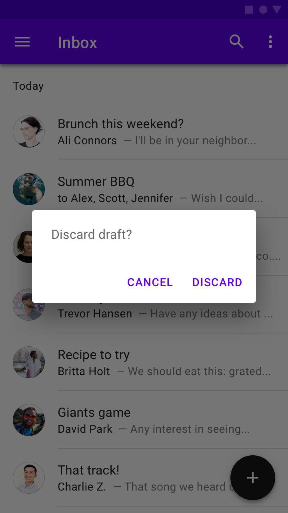
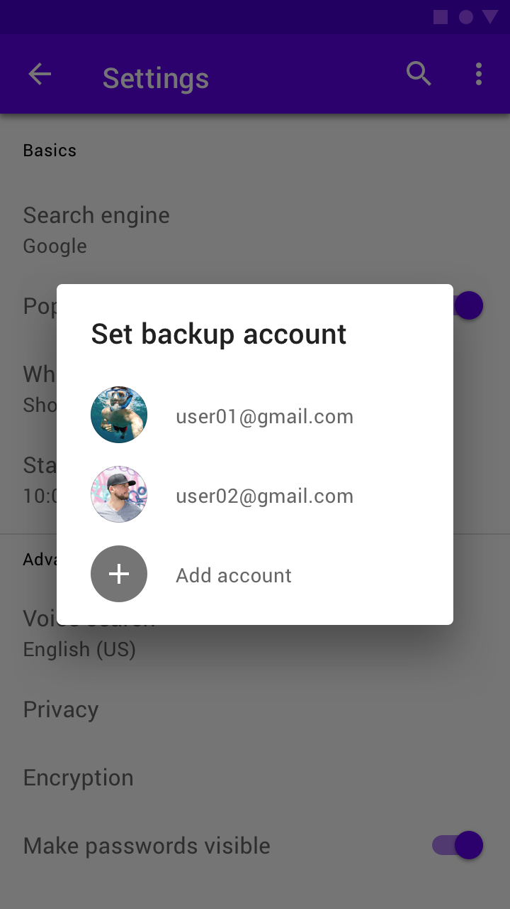
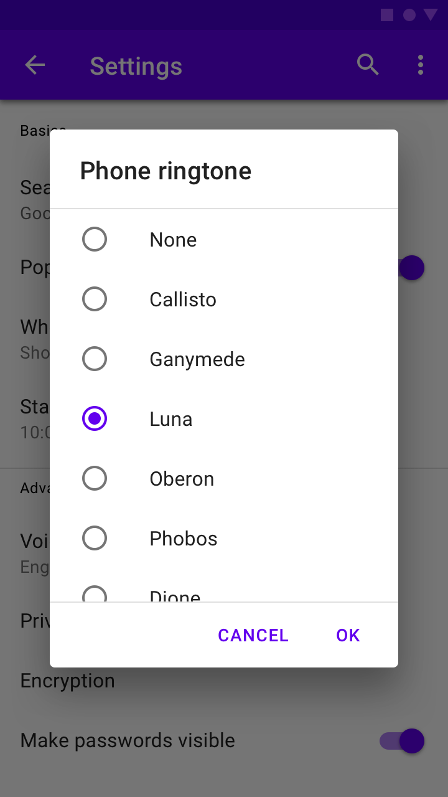
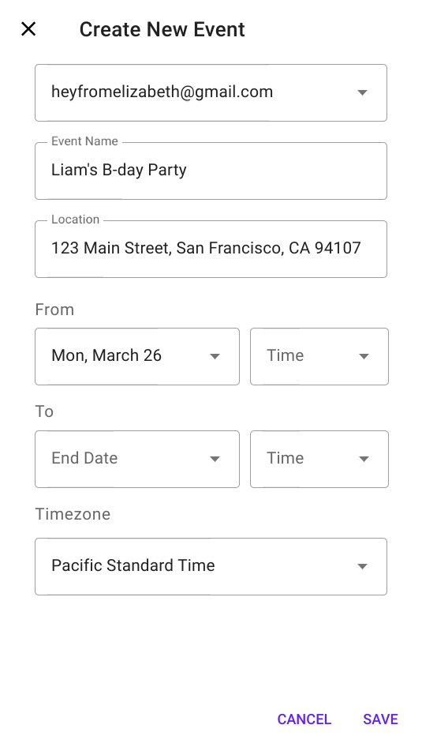

<!--docs:
title: "Dialogs"
layout: detail
section: components
excerpt: "Modal dialogs."
iconId: dialog
path: /catalog/dialogs/
-->

# Dialogs

Dialogs inform users about a task and can contain critical information, require decisions, or involve multiple tasks.

There are four types of dialogs:

1. [Alert](#alert-dialog)
1. [Simple](#simple-dialog)
1. [Confirmation](#confirmation-dialog)
1. [Full-screen](#full-screen-dialog)

## Using dialogs

A dialog is a type of modal window that appears in front of app content to provide critical information or ask for a decision. Dialogs disable all app functionality when they appear, and remain on screen until confirmed, dismissed, or a required action has been taken.

Dialogs are purposefully interruptive, so they should be used sparingly.

For additional guidance, refer to the [Material guidelines](https://material.io/go/design-dialogs).

### Installation

```
npm install @material/dialog
```

### Styles

```scss
@use "@material/dialog";

@include dialog.core-styles;
```

**Note: Styles for any components you intend to include within dialogs (e.g. List, Checkboxes, etc.) must also be imported.**

### JavaScript Instantiation

```js
import {MDCDialog} from '@material/dialog';
const dialog = new MDCDialog(document.querySelector('.mdc-dialog'));
```

**Note: See [Importing the JS component](../../docs/importing-js.md) for more information on how to import JavaScript.**

MDC Dialog makes no assumptions about what will be added to the `mdc-dialog__content` element. Any list, checkboxes,
etc. must also be instantiated. If your dialog contains any layout-sensitive components, you should wait until
`MDCDialog:opened` is emitted to instantiate them (or call `layout` on them) so that the dialog's transition finishes
first.

For example, to instantiate an MDC List inside of a simple or confirmation dialog:

```js
import {MDCList} from '@material/list';
const list = new MDCList(document.querySelector('.mdc-dialog .mdc-deprecated-list'));

dialog.listen('MDCDialog:opened', () => {
  list.layout();
});
```

**Note: Mispositioned or incorrectly-sized elements (e.g. ripples, floating labels, notched outlines) are a strong
indication that child components are being instantiated before the dialog has finished opening.**

### Making dialogs accessible

#### Using `aria-hidden` as a fallback for `aria-modal`

`aria-modal` is part of the ARIA 1.1 specification, and indicates to screen readers that they should confine themselves to a single element. We recommend adding `aria-modal="true"` to the root element of its DOM structure.

However, not all user agents and screen readers properly interpret this attribute.

The fallback is to use `aria-hidden` using `aria-hidden="true"` to all static content beneath the dialog when the dialog is open. This will be easiest to achieve if all non-modal elements are under a single common ancestor under the body, so that `aria-hidden` can be applied to one element.

```js
dialog.listen('MDCDialog:opened', function() {
  // Assuming contentElement references a common parent element with the rest of the page's content
  contentElement.setAttribute('aria-hidden', 'true');
});
dialog.listen('MDCDialog:closing', function() {
  contentElement.removeAttribute('aria-hidden');
});
```

**Note: The example above intentionally listens to the opened (not opening) event and the closing (not closed) event in order to avoid additional jumping between elements by screen readers due to one element becoming hidden before others become visible.**

## Alert dialog

Alert dialogs interrupt users with urgent information, details, or actions.



### Alert dialog example

```html
<div class="mdc-dialog">
  <div class="mdc-dialog__container">
    <div class="mdc-dialog__surface"
      role="alertdialog"
      aria-modal="true"
      aria-labelledby="my-dialog-title"
      aria-describedby="my-dialog-content">
      <div class="mdc-dialog__content" id="my-dialog-content">
        Discard draft?
      </div>
      <div class="mdc-dialog__actions">
        <button type="button" class="mdc-button mdc-dialog__button" data-mdc-dialog-action="cancel">
          <div class="mdc-button__ripple"></div>
          <span class="mdc-button__label">Cancel</span>
        </button>
        <button type="button" class="mdc-button mdc-dialog__button" data-mdc-dialog-action="discard">
          <div class="mdc-button__ripple"></div>
          <span class="mdc-button__label">Discard</span>
        </button>
      </div>
    </div>
  </div>
  <div class="mdc-dialog__scrim"></div>
</div>
```

## Simple dialog

Simple dialogs can display items that are immediately actionable when selected. They don’t have text buttons.

As simple dialogs are interruptive, they should be used sparingly. Alternatively, dropdown menus provide options in a non-modal, less disruptive way.



### Simple dialog example

```html
<div class="mdc-dialog">
  <div class="mdc-dialog__container">
    <div class="mdc-dialog__surface"
      role="alertdialog"
      aria-modal="true"
      aria-labelledby="my-dialog-title"
      aria-describedby="my-dialog-content">
      <!-- Title cannot contain leading whitespace due to mdc-typography-baseline-top() -->
      <h2 class="mdc-dialog__title" id="my-dialog-title"><!--
     -->Choose a Ringtone<!--
   --></h2>
      <div class="mdc-dialog__content" id="my-dialog-content">
        <ul class="mdc-deprecated-list mdc-deprecated-list--avatar-list">
          <li class="mdc-deprecated-list-item" tabindex="0" data-mdc-dialog-action="none">
            <span class="mdc-deprecated-list-item__text">None</span>
          </li>
          <li class="mdc-deprecated-list-item" data-mdc-dialog-action="callisto">
            <span class="mdc-deprecated-list-item__text">Callisto</span>
          </li>
          <!-- ... -->
        </ul>
      </div>
    </div>
  </div>
  <div class="mdc-dialog__scrim"></div>
</div>
```

**Note: Note the inclusion of the `mdc-deprecated-list--avatar-list` class, which aligns with the Simple Dialog spec.**

## Confirmation dialog

Confirmation dialogs give users the ability to provide final confirmation of a choice before committing to it, so they have a chance to change their minds if necessary.

If the user confirms a choice, it’s carried out. Otherwise, the user can dismiss the dialog. For example, users can listen to multiple ringtones but only make a final selection upon tapping “OK.”



### Confirmation dialog example

```html
<div class="mdc-dialog">
  <div class="mdc-dialog__container">
    <div class="mdc-dialog__surface"
      role="alertdialog"
      aria-modal="true"
      aria-labelledby="my-dialog-title"
      aria-describedby="my-dialog-content">
      <!-- Title cannot contain leading whitespace due to mdc-typography-baseline-top() -->
      <h2 class="mdc-dialog__title" id="my-dialog-title"><!--
     -->Choose a Ringtone<!--
   --></h2>
      <div class="mdc-dialog__content" id="my-dialog-content">
        <ul class="mdc-deprecated-list">
          <li class="mdc-deprecated-list-item" tabindex="0">
            <span class="mdc-deprecated-list-item__graphic">
              <div class="mdc-radio">
                <input class="mdc-radio__native-control"
                       type="radio"
                       id="test-dialog-baseline-confirmation-radio-1"
                       name="test-dialog-baseline-confirmation-radio-group"
                       checked>
                <div class="mdc-radio__background">
                  <div class="mdc-radio__outer-circle"></div>
                  <div class="mdc-radio__inner-circle"></div>
                </div>
              </div>
            </span>
            <label id="test-dialog-baseline-confirmation-radio-1-label"
                   for="test-dialog-baseline-confirmation-radio-1"
                   class="mdc-deprecated-list-item__text">None</label>
          </li>
          <!-- ... -->
        </ul>
      </div>
      <div class="mdc-dialog__actions">
        <button type="button" class="mdc-button mdc-dialog__button" data-mdc-dialog-action="close">
          <div class="mdc-button__ripple"></div>
          <span class="mdc-button__label">Cancel</span>
        </button>
        <button type="button" class="mdc-button mdc-dialog__button" data-mdc-dialog-action="accept">
          <div class="mdc-button__ripple"></div>
          <span class="mdc-button__label">OK</span>
        </button>
      </div>
    </div>
  </div>
  <div class="mdc-dialog__scrim"></div>
</div>
```

**Note: In the example above, the Cancel button intentionally has the `close` action to align with the behavior of
clicking the scrim or pressing the Escape key, allowing all interactions involving dismissal without taking an action
to be detected the same way.**

## Full-screen dialog

Full-screen dialogs group a series of tasks, such as creating a calendar entry with the event title, date, location, and time.



### Full-screen dialog example

```html
<div class="mdc-dialog mdc-dialog--open mdc-dialog--fullscreen">
  <div class="mdc-dialog__container">
    <div class="mdc-dialog__surface"
      role="dialog"
      aria-modal="true"
      aria-labelledby="my-dialog-title"
      aria-describedby="my-dialog-content">
      <div class="mdc-dialog__header">
        <h2 class="mdc-dialog__title" id="my-dialog-title">
          Full-Screen Dialog Title
        </h2>
        <button class="mdc-icon-button material-icons mdc-dialog__close"
                data-mdc-dialog-action="close">
          close
        </button>
      </div>
      <div class="mdc-dialog__content" id="my-dialog-content">
        Lorem ipsum dolor sit amet, consectetur adipiscing elit.
        Sed scelerisque metus dapibus, maximus massa pulvinar, commodo nunc.
        Quisque vitae luctus lectus, ut tempus ipsum. Sed suscipit gravida scelerisque.
        Aenean vulputate elementum est, quis consectetur orci consectetur ac.
        Quisque accumsan vel nisi id dapibus. Suspendisse nec urna eu massa ornare rutrum.
        Vivamus at nisi sit amet nulla pretium volutpat sit amet in justo. Donec mi metus,
        interdum ac tincidunt at, vehicula vitae nisl. Morbi fermentum dapibus massa,
        nec lobortis massa vestibulum eu.
      </div>
      <div class="mdc-dialog__actions">
        <button type="button" class="mdc-button mdc-dialog__button"
                data-mdc-dialog-action="ok">
          <div class="mdc-button__ripple"></div>
          <span class="mdc-button__label">OK</span>
        </button>
      </div>
    </div>
  </div>
  <div class="mdc-dialog__scrim"></div>
</div>
```

Note: Full-screen dialogs are intended for mobile/small-screen devices. The
dialog's size will adapt to the screen size, and so becomes modal if used on
larger screen sizes.

## Additional Information

### Dialog actions

All dialog variants support the concept of dialog actions. Any element within a dialog may include the
`data-mdc-dialog-action` attribute to indicate that interacting with it should close the dialog with the specified action.
This action is then reflected via `event.detail.action` in the `MDCDialog:closing` and `MDCDialog:closed` events.

Additionally, two interactions have defined actions by default:

* Clicking on the scrim
* Pressing the Escape key within the dialog

Both of these map to the `close` action by default. This can be accessed and customized via the component's
`scrimClickAction` and `escapeKeyAction` properties, respectively.

Setting either of these properties to an empty string will result in that interaction being disabled (i.e. the dialog
will no longer close in response to the interaction). Exercise caution when doing this - it should always be possible
for a user to dismiss the dialog.

Any action buttons within the dialog which equate strictly to a dismissal with no further action should also use the
`close` action; this will make it easy to handle all such interactions consistently, while separately handling other
actions.

### Action button arrangement

As indicated in the [Dialog design article](https://material.io/design/components/dialogs.html#anatomy), buttons within
the `mdc-dialog__actions` element are arranged horizontally by default, with the confirming action _last_.

In cases where the button text is too long for all buttons to fit on a single line, the buttons are stacked vertically,
with the confirming action _first_.

MDC Dialog detects and handles this automatically by default, reversing the buttons when applying the stacked layout.
This automatic behavior can be disabled by setting `autoStackButtons` to `false` on the component instance:

```js
dialog.autoStackButtons = false;
```

This will also be disabled if the `mdc-dialog--stacked` modifier class is applied manually to the root element before the
component is instantiated, but note that dialog action button labels are recommended to be short enough to fit on a
single line if possible.

### Default action button

MDC Dialog supports indicating that one of its action buttons represents the default action, triggered by pressing the
Enter key. This can be used e.g. for single-choice Confirmation Dialogs to accelerate the process of making a selection,
avoiding the need to tab through to the appropriate button to confirm the choice.

To indicate that a button represents the default action, add the `data-mdc-dialog-button-default` data attribute.
For example:
```html
...
<div class="mdc-dialog__actions">
  <button type="button" class="mdc-button mdc-dialog__button" data-mdc-dialog-action="close">
    <div class="mdc-button__ripple"></div>
    <span class="mdc-button__label">Cancel</span>
  </button>
  <button type="button" class="mdc-button mdc-dialog__button" data-mdc-dialog-action="accept" data-mdc-dialog-button-default>
    <div class="mdc-button__ripple"></div>
    <span class="mdc-button__label">OK</span>
  </button>
</div>
...
```

### Actions and selections

Dialogs which require making a choice via selection controls should initially disable any button which performs an
action if no choice is selected by default. MDC Dialog does not include built-in logic for this, since it aims to remain
as unopinionated as possible regarding dialog contents, aside from relaying information on which action is taken.

## Style customizations

### CSS classes

CSS Class | Description
--- | ---
`mdc-dialog` | Mandatory. The root DOM element containing the surface and the container.
`mdc-dialog__scrim` | Mandatory. Semitransparent backdrop that displays behind a dialog.
`mdc-dialog__container` | Mandatory. Wrapper element needed to ensure flexbox behavior in IE 11.
`mdc-dialog__surface` | Mandatory. The bounding box for the dialog's content.
`mdc-dialog__title` | Optional. Brief summary of the dialog's purpose.
`mdc-dialog__content` | Optional. Primary content area. May contain a list, a form, or prose.
`mdc-dialog__actions` | Optional. Footer area containing the dialog's action buttons.
`mdc-dialog__button` | Optional. Individual action button. Typically paired with [`mdc-button`](../mdc-button).
`mdc-dialog--open` | Optional. Indicates that the dialog is open and visible.
`mdc-dialog--opening` | Optional. Applied automatically when the dialog is in the process of animating open.
`mdc-dialog--closing` | Optional. Applied automatically when the dialog is in the process of animating closed.
`mdc-dialog--scrollable` | Optional. Applied automatically when the dialog has overflowing content to warrant scrolling.
`mdc-dialog--stacked` | Optional. Applied automatically when the dialog's action buttons can't fit on a single line and must be stacked.

### Sass mixins

Mixin | Description
--- | ---
`container-fill-color($color)` | Sets the fill color of the dialog.
`scrim-color($color, $opacity)` | Sets the color of the scrim behind the dialog.
`title-ink-color($color, $opacity)` | Sets the color of the dialog's title text.
`content-ink-color($color, $opacity)` | Sets the color of the dialog's content text.
`content-padding($padding-top, $padding-right, $padding-bottom, $padding-left)` | Sets the padding of the dialog's content.
`scroll-divider-color($color, $opacity)` | Sets the color of the dividers which display around scrollable content.
`shape-radius($radius, $rtl-reflexive)` | Sets the rounded shape to dialog surface with given radius size. Set `$rtl-reflexive` to true to flip radius values in RTL context, defaults to false.
`min-width($min-width)` | Sets the minimum width of the dialog (defaults to 280px).
`max-width($max-width, $margin)` | Sets the maximum width of the dialog (defaults to 560px max width and 16px margins).
`max-height($max-height, $margin)` | Sets the maximum height of the dialog (defaults to no max height and 16px margins).

**Note: The `max-width` and `max-height` mixins only apply their maximum when the viewport is large enough to accommodate the specified value when accounting for the specified margin on either side. When the viewport is smaller, the dialog is sized such that the given margin is retained around the edges.**

## Other customizations

Data Attributes | Description
--- | ---
`data-mdc-dialog-button-default` | Optional. Add to a button to indicate that it is the default action button (see Default Action Button section above).
`data-mdc-dialog-initial-focus` | Optional. Add to an element to indicate that it is the element to initially focus on after the dialog has opened.

## `MDCDialog` properties and methods

Property | Value Type | Description
--- | --- | ---
`isOpen` | `boolean` (read-only) | Proxies to the foundation's `isOpen` method.
`escapeKeyAction` | `string` | Proxies to the foundation's `getEscapeKeyAction` and `setEscapeKeyAction` methods.
`scrimClickAction` | `string` | Proxies to the foundation's `getScrimClickAction` and `setScrimClickAction` methods.
`autoStackButtons` | `boolean` | Proxies to the foundation's `getAutoStackButtons` and `setAutoStackButtons` methods.

Method Signature | Description
--- | ---
`layout() => void` | Recalculates layout and automatically adds/removes modifier classes like `--scrollable`.
`open() => void` | Opens the dialog.
`close(action: string?) => void` | Closes the dialog, optionally with the specified action indicating why it was closed.

### Events

Event Name | `event.detail` | Description
--- | --- | ---
`MDCDialog:opening` | `{}` | Indicates when the dialog begins its opening animation.
`MDCDialog:opened` | `{}` | Indicates when the dialog finishes its opening animation.
`MDCDialog:closing` | `{action: string?}` | Indicates when the dialog begins its closing animation. `action` represents the action which closed the dialog.
`MDCDialog:closed` | `{action: string?}` | Indicates when the dialog finishes its closing animation. `action` represents the action which closed the dialog.

## Usage within web frameworks

If you are using a JavaScript framework, such as React or Angular, you can create a Dialog for your framework. Depending on your needs, you can use the _Simple Approach: Wrapping MDC Web Vanilla Components_, or the _Advanced Approach: Using Foundations and Adapters_. Please follow the instructions [here](../../docs/integrating-into-frameworks.md).

### `MDCDialogAdapter`

Method Signature | Description
--- | ---
`addClass(className: string) => void` | Adds a class to the root element.
`removeClass(className: string) => void` | Removes a class from the root element.
`hasClass(className: string) => boolean` | Returns whether the given class exists on the root element.
`addBodyClass(className: string) => void` | Adds a class to the `<body>`.
`removeBodyClass(className: string) => void` | Removes a class from the `<body>`.
`eventTargetMatches(target: EventTarget \| null, selector: string) => void` | Returns `true` if the target element matches the given CSS selector, otherwise `false`.
`trapFocus(initialFocusEl: HTMLElement \| null) => void` | Sets up the DOM such that keyboard navigation is restricted to focusable elements within the dialog surface (see [Handling Focus Trapping](#handling-focus-trapping) below for more details). Moves focus to `initialFocusEl`, if set.
`releaseFocus() => void` | Removes any effects of focus trapping on the dialog surface (see [Handling Focus Trapping](#handling-focus-trapping) below for more details).
`getInitialFocusEl() => HTMLElement \| null` | Returns the `data-mdc-dialog-initial-focus` element to add focus to after the dialog has opened.
`isContentScrollable() => boolean` | Returns `true` if `mdc-dialog__content` can be scrolled by the user, otherwise `false`.
`areButtonsStacked() => boolean` | Returns `true` if `mdc-dialog__action` buttons (`mdc-dialog__button`) are stacked vertically, otherwise `false` if they are side-by-side.
`getActionFromEvent(event: Event) => string \| null` | Retrieves the value of the `data-mdc-dialog-action` attribute from the given event's target, or an ancestor of the target.
`clickDefaultButton() => void` | Invokes `click()` on the `data-mdc-dialog-button-default` element, if one exists in the dialog.
`reverseButtons() => void` | Reverses the order of action buttons in the `mdc-dialog__actions` element. Used when switching between stacked and unstacked button layouts.
`notifyOpening() => void` | Broadcasts an event denoting that the dialog has just started to open.
`notifyOpened() => void` | Broadcasts an event denoting that the dialog has finished opening.
`notifyClosing(action: string) {}` | Broadcasts an event denoting that the dialog has just started closing. If a non-empty `action` is passed, the event's `detail` object should include its value in the `action` property.
`notifyClosed(action: string) {}` | Broadcasts an event denoting that the dialog has finished closing. If a non-empty `action` is passed, the event's `detail` object should include its value in the `action` property.

### `MDCDialogFoundation`

Method Signature | Description
--- | ---
`open()` | Opens the dialog.
`close(action: string)` | Closes the dialog, optionally with the specified action indicating why it was closed.
`isOpen() => boolean` | Returns whether the dialog is open.
`layout()` | Recalculates layout and automatically adds/removes modifier classes e.g. `--scrollable`.
`getEscapeKeyAction() => string` | Returns the action reflected when the Escape key is pressed.
`setEscapeKeyAction(action: string)` | Sets the action reflected when the Escape key is pressed. Setting to `''` disables closing the dialog via Escape key.
`getScrimClickAction() => string` | Returns the action reflected when the scrim is clicked.
`setScrimClickAction(action: string)` | Sets the action reflected when the scrim is clicked. Setting to `''` disables closing the dialog via scrim click.
`getAutoStackButtons() => boolean` | Returns whether stacked/unstacked action button layout is automatically handled during layout logic.
`setAutoStackButtons(autoStack: boolean) => void` | Sets whether stacked/unstacked action button layout is automatically handled during layout logic.
`handleClick(event: MouseEvent)` | Handles `click` events on or within the dialog's root element.
`handleKeydown(event: KeyboardEvent)` | Handles `keydown` events on or within the dialog's root element.
`handleDocumentKeydown(event: Event)` | Handles `keydown` events on or within the document while the dialog is open.
`getSuppressDefaultPressSelector() => string` | Returns the selector string for elements that suppress the default dialog press action, such as pressing enter in a textarea.
`setSuppressDefaultPressSelector(selector: string)` | Customize the selector string to suppress the default dialog press action. An empty string indicates that no elements should suppress the default action.

#### Event handlers

When wrapping the Dialog foundation, the following events must be bound to the indicated foundation methods:

Event | Target | Foundation Handler | Register | Deregister
--- | --- | --- | --- | ---
`click` | `.mdc-dialog` (root) | `handleClick` | During initialization | During destruction
`keydown` | `.mdc-dialog` (root) | `handleKeydown` | During initialization | During destruction
`keydown` | `document` | `handleDocumentKeydown` | On `MDCDialog:opening` | On `MDCDialog:closing`
`resize` | `window` | `layout` | On `MDCDialog:opening` | On `MDCDialog:closing`
`orientationchange` | `window` | `layout` | On `MDCDialog:opening` | On `MDCDialog:closing`

### The `util` API

External frameworks and libraries can use the following utility methods from the `util` module when implementing their own component.

Method Signature | Description
--- | ---
`createFocusTrapInstance(surfaceEl: Element, focusTrapFactory: function(): !FocusTrap, initialFocusEl: ?Element) => !FocusTrap` | Creates a properly configured [focus-trap][] instance.
`isScrollable(el: Element \| null) => boolean` | Determines if the given element is scrollable.
`areTopsMisaligned(els: Element[]) => boolean` | Determines if two or more of the given elements have different `offsetTop` values.

### Handling focus trapping

In order for dialogs to be fully accessible, they must conform to the guidelines outlined in:

* https://www.w3.org/TR/wai-aria-practices/#dialog_modal
* https://www.w3.org/TR/wai-aria-practices-1.1/examples/dialog-modal/dialog.html
* https://developer.mozilla.org/en-US/docs/Web/Accessibility/ARIA/ARIA_Techniques/Using_the_dialog_role

The main implication of these guidelines is that the only focusable elements are those contained within a dialog
surface.

Trapping focus correctly for a modal dialog requires a complex set of events and interaction
patterns that we feel is best not duplicated within the logic of this component. Furthermore,
frameworks and libraries may have their own ways of trapping focus that framework authors may want
to make use of. For this reason, we have two methods on the adapter that should be used to handle
focus trapping:

* `trapFocus()` is called when the dialog is open and should set up focus trapping adhering
  to the ARIA practices in the link above.
* `releaseFocus()` is called when the dialog is closed and should tear down any focus
  trapping set up when the dialog was open.

The `MDCDialog` component uses the [focus-trap][] package to handle this.
**You can use `util.createFocusTrapInstance()` (see below) to easily create
a focus trapping solution for your component code.**

[focus-trap]: https://github.com/davidtheclark/focus-trap

**Note: iOS platform doesn't seem to register currently focused element via `document.activeElement` which causes releasing focus to last focused element fail.**

#### `createFocusTrapInstance()`

```js
const {activate, deactivate} =
  util.createFocusTrapInstance(surfaceEl, focusTrapFactory, initialFocusEl);
```

Given a dialog surface element an optional `focusTrap` factory function, and an optional initial element to focus,
such that:

* The focus is trapped within the `surfaceEl`
* The `initialFocusEl` receives focus when the focus trap is activated
    - If omitted, defaults to the first focusable element in `surfaceEl`
* Closing the dialog in any way (including pressing Escape or clicking outside the dialog) deactivates focus trapping
* Focus is returned to the previously focused element before the focus trap was activated

This focus trap instance can be used to implement the `trapFocus` and `releaseFocus` adapter methods by calling
`instance.activate()` and `instance.deactivate()` respectively within those methods.

The `focusTrapFactory` can be used to override the `focus-trap` function used to create the focus trap. Its API is the
same as focus-trap's [createFocusTrap](https://github.com/davidtheclark/focus-trap#focustrap--createfocustrapelement-createoptions)
(which is what it defaults to). You can pass in a custom function for mocking out the actual function within tests,
or to modify the arguments passed to the function before it's called.
