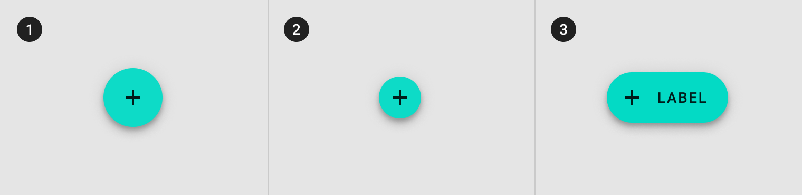

<!--docs:
title: "Floating Action Button"
layout: detail
section: components
excerpt: "A floating action button represents the primary action in an application"
iconId: button
path: /catalog/buttons/floating-action-buttons/
-->

# Floating action buttons

A floating action button (FAB) represents the primary action of a screen.

There are three types of FABS:

1. [Regular FABs](#regular-fabs)
2. [Mini FABs](#mini-fabs)
3. [Extended FABs](#extended-fabs)



## Using FABs

A FAB performs the primary, or most common, action on a screen. It appears in
front of all screen content, typically as a circular shape with an icon in its
center.

### Installation

```
npm install @material/fab
```

### Styles

```scss
@use "@material/fab";

@include fab.core-styles;
```

### Loading icons

We recommend using [Material Icons](https://material.io/tools/icons/) from Google Fonts:

```html
<head>
  <link rel="stylesheet" href="https://fonts.googleapis.com/icon?family=Material+Icons">
</head>
```

However, you can also use SVG, [Font Awesome](https://fontawesome.com/), or any other icon library you wish.

### JavaScript instantiation

The FAB will work without JavaScript, but you can enhance it to have a ripple effect by instantiating `MDCRipple` on the root element. See [MDC Ripple](../mdc-ripple) for details.

```js
import {MDCRipple} from '@material/ripple';

const fabRipple = new MDCRipple(document.querySelector('.mdc-fab'));
```

See [Importing the JS component](../../docs/importing-js.md) for more information on how to import JavaScript.

### Making FABs accessible

Material Design spec advises that touch targets should be at least
48px x 48px. While the FAB is 48x48px by default, the mini FAB is 40x40px.
Add the following to meet this requirement for mini FABs:

```html
<div class="mdc-touch-target-wrapper">
  <button class="mdc-fab mdc-fab--mini mdc-fab--touch">
    <div class="mdc-fab__ripple"></div>
    <span class="material-icons mdc-fab__icon">add</span>
    <span class="mdc-fab__label">Create</span>
    <div class="mdc-fab__touch"></div>
  </button>
</div>
```

**Note: The outer `mdc-touch-target-wrapper` element is only necessary if you want to avoid potentially overlapping touch targets on adjacent elements (due to collapsing margins).**

## Regular FABs

Regular FABs are FABs that are not expanded and are a regular size.

### Regular FAB example

```html
<button class="mdc-fab" aria-label="Favorite">
  <div class="mdc-fab__ripple"></div>
  <span class="mdc-fab__icon material-icons">favorite</span>
</button>
```

**Note: The floating action button icon can be used with a `span`, `i`, `img`, or `svg` element.**

**Note: IE 11 will not center the icon properly if there is a newline or space after the material icon text.**

## Mini FABs

A mini FAB should be used on smaller screens.

Mini FABs can also be used to create visual continuity with other screen elements.

### Mini FAB example

```html
<button class="mdc-fab mdc-fab--mini" aria-label="Favorite">
  <div class="mdc-fab__ripple"></div>
  <span class="mdc-fab__icon material-icons">favorite</span>
</button>
```

## Extended FABs

The extended FAB is wider, and it includes a text label.

### Extended FAB example

```html
<button class="mdc-fab mdc-fab--extended">
  <div class="mdc-fab__ripple"></div>
  <span class="material-icons mdc-fab__icon">add</span>
  <span class="mdc-fab__label">Create</span>
</button>
```

**Note: The extended FAB must contain label where as the icon is optional. The icon and label may be specified in whichever order is appropriate based on context.**

## API

### CSS classes

CSS Class | Description
--- | ---
`mdc-fab` | Mandatory, for the button element
`mdc-fab__icon` | Mandatory, for the icon element
`mdc-fab__ripple` | Mandatory, for the element which shows the ripple.
`mdc-fab__label` | Optional, for the text label. Applicable only for Extended FAB.
`mdc-fab--mini` | Optional, modifies the FAB to a smaller size
`mdc-fab--extended` | Optional, modifies the FAB to wider size which includes a text label.
`mdc-fab--exited` | Optional, animates the FAB out of view.<br>When this class is removed, the FAB will return to view.

> **A note about `:disabled`**: No disabled styles are defined for FABs. The FAB promotes action, and should not be displayed in a disabled state. If you want to present a FAB that does *not* perform an action, you should also present an explanation to the user.

### Sass mixins

#### Basic Sass mixins

MDC FAB uses [MDC Theme](../mdc-theme)'s `secondary` color by default. Use the following mixins to customize it.

Mixin | Description
--- | ---
`accessible($container-color)` | Changes the FAB's container color to the given color, and updates the FAB's ink and ripple color to meet accessibility standards.
`extended-fluid` | Makes the Extended FAB fluid to container, such as screen width or the layout grid. Exposed as a mixin to support use within `@media` queries.

#### Advanced Sass mixins

> **A note about advanced mixins**: The following mixins are intended for advanced users. These mixins will override the color of the container, ink, or ripple. You can use all of them if you want to completely customize a FAB. Or you can use only one of them, e.g. if you only need to override the ripple color. **It is up to you to pick container, ink, and ripple colors that work together, and meet accessibility standards.**

Mixin | Description
--- | ---
`container-color($color)` | Sets the container color to the given color
`icon-size($width, $height)` | Sets the icon `width`, `height`, and `font-size` properties to the specified `width` and `height`. `$height` is optional and will default to `$width` if omitted. The `font-size` will be set to the provided `$width` value.
`ink-color($color)` | Sets the ink color to the given color
`extended-padding($icon-padding, $label-padding)` | Sets the padding on both sides of the icon, and between the label and the edge of the FAB. In cases where there is no icon, `$label-padding` will apply to both sides.
`extended-label-padding($label-padding)` | Sets the label side padding for Extended FAB. Useful when styling an Extended FAB with no icon.
`shape-radius($radius, $rtl-reflexive)` | Sets rounded shape to only regular & mini FAB variants with given radius size. Set `$rtl-reflexive` to true to flip radius values in RTL context, defaults to false.
`extended-shape-radius($radius, $rtl-reflexive)` | Sets rounded shape to only Extended FAB variant with given radius size. Set `$rtl-reflexive` to true to flip radius values in RTL context, defaults to false.
