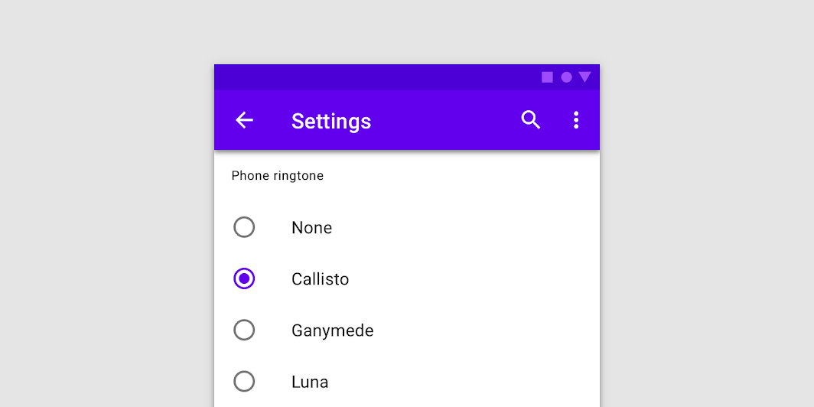
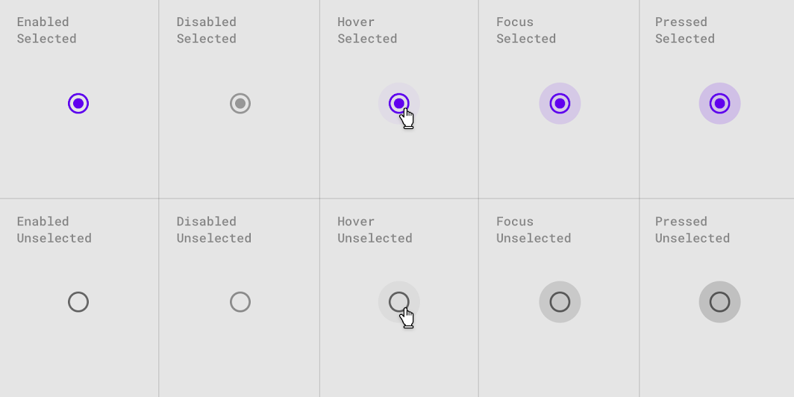

<!--docs:
title: "Radio Buttons"
layout: detail
section: components
iconId: radio_button
path: /catalog/input-controls/radio-buttons/
-->

# Selection controls: radio buttons

[Selection controls](https://material.io/components/selection-controls#usage) allow the user to select options.

Use radio buttons to:

* Select a single option from a list
* Expose all available options
* If available options can be collapsed, consider using a dropdown menu instead, as it uses less space.



**Contents**

* [Using radio buttons](#using-radio-buttons)
* [Radio buttons](#radio-buttons)
* [Other variants](#other-variants)
* [API](#api)
* [Usage within web frameworks](#usage-within-web-frameworks)

## Using radio buttons

Radio buttons allow the user to select one option from a set. Use radio buttons when the user needs to see all available options. If available options can be collapsed, consider using a dropdown menu because it uses less space.

### Installing radio buttons

```
npm install @material/radio
```

### Styles

```scss
@use "@material/radio/styles";
@use "@material/form-field";

@include form-field.core-styles;
```

**Note: The form field styles are only required when the radio button is used with the form field.**

### JavaScript instantiation

The radio button will work without JavaScript, but you can enhance it with a ripple interaction effect by instantiating `MDCRadio` on the `mdc-radio` element. To activate the ripple effect upon interacting with the label, you must also instantiate `MDCFormField` on the `mdc-form-field` element and set the `MDCRadio` instance as its `input`.

```js
import {MDCFormField} from '@material/form-field';
import {MDCRadio} from '@material/radio';

const radio = new MDCRadio(document.querySelector('.mdc-radio'));
const formField = new MDCFormField(document.querySelector('.mdc-form-field'));
formField.input = radio;
```

**Note: See [Importing the JS component](../../docs/importing-js.md) for more information on how to import JavaScript.**

### Making radio buttons accessible

Material Design spec advises that touch targets should be at least 48px x 48px.
To meet this requirement, add the `mdc-radio--touch` class to your radio as follows:

```html
<div class="mdc-touch-target-wrapper">
  <div class="mdc-radio mdc-radio--touch">
    <input class="mdc-radio__native-control" type="radio" id="radio-1" name="radios" checked>
    <div class="mdc-radio__background">
      <div class="mdc-radio__outer-circle"></div>
      <div class="mdc-radio__inner-circle"></div>
    </div>
    <div class="mdc-radio__ripple"></div>
  </div>
</div>
```

Note that the outer  `mdc-touch-target-wrapper` element is only necessary if you want to avoid potentially overlapping touch targets on adjacent elements (due to collapsing margins).

## Radio buttons

We recommend using MDC Radio with [MDC Form Field](../mdc-form-field) for enhancements such as label alignment, label activation of the ripple interaction effect, and RTL-awareness.

### Radio button example

```html
<div class="mdc-form-field">
  <div class="mdc-radio">
    <input class="mdc-radio__native-control" type="radio" id="radio-1" name="radios" checked>
    <div class="mdc-radio__background">
      <div class="mdc-radio__outer-circle"></div>
      <div class="mdc-radio__inner-circle"></div>
    </div>
    <div class="mdc-radio__ripple"></div>
  </div>
  <label for="radio-1">Radio 1</label>
</div>
```

### Radio button states

Radio buttons can be selected or unselected. Radio buttons have enabled, disabled, hover, focused, and pressed states.



## Other variants

### Disabled radio buttons

To disable a radio button, add the `mdc-radio--disabled` class to the root element and set the `disabled` attribute on the `<input>` element.
Disabled radio buttons cannot be interacted with and have no visual interaction effect.

```html
<div class="mdc-form-field">
  <div class="mdc-radio mdc-radio--disabled">
    <input class="mdc-radio__native-control" type="radio" id="radio-1" name="radios" disabled>
    <div class="mdc-radio__background">
      <div class="mdc-radio__outer-circle"></div>
      <div class="mdc-radio__inner-circle"></div>
    </div>
    <div class="mdc-radio__ripple"></div>
  </div>
  <label for="radio-1">Radio 1</label>
</div>
```

## API

### Sass mixins

MDC Radio uses [MDC Theme](../mdc-theme)'s `secondary` color by default. Use the following mixins to customize it.

Mixin | Description
--- | ---
`unchecked-stroke-color($color)` | Sets the stroke color of an unchecked, enabled radio button
`checked-stroke-color($color)` | Sets the stroke color of a checked, enabled radio button
`ink-color($color)` | Sets the ink color of an enabled radio button
`disabled-unchecked-stroke-color($color)` | Sets the stroke color of an unchecked, disabled radio button
`disabled-checked-stroke-color($color)` | Sets the stroke color of a checked, disabled radio button
`disabled-ink-color($color)` | Sets the ink color of a disabled radio button
`focus-indicator-color($color)` | Sets the color of the focus indicator
`touch-target($size, $ripple-size)` | Sets radio touch target size which can be more than the ripple size. Param `$ripple-size` is required for custom ripple size, defaults to `$ripple-size`.
`ripple-size($size)` | Sets custom ripple size of radio.
`density($density-scale)` | Sets density scale for radio. Supported density scale values are `-3`, `-2`, `-1` and `0` (default).

## `MDCRadio` properties and methods

Property | Value Type | Description
--- | --- | ---
`checked` | Boolean | Setter/getter for the radio's checked state
`disabled` | Boolean | Setter/getter for the radio's disabled state. Setter proxies to foundation's `setDisabled` method
`value` | String | Setter/getter for the radio's value

## Usage within web frameworks

If you are using a JavaScript framework, such as React or Angular, you can create a Radio button for your framework. Depending on your needs, you can use the _Simple Approach: Wrapping MDC Web Vanilla Components_, or the _Advanced Approach: Using Foundations and Adapters_. Please follow the instructions [here](../../docs/integrating-into-frameworks.md).

### `MDCRadioAdapter`

Method Signature | Description
--- | ---
`setNativeControlDisabled(disabled: boolean) => void` | Sets the input's `disabled` property to the given value
`addClass(className: string) => void` | Adds a class to the root element
`removeClass(className: string) => void` | Removes a class from the root element

### `MDCRadioFoundation`

Method Signature | Description
--- | ---
`setDisabled(disabled: boolean) => void` | Sets the disabled value of the native control
