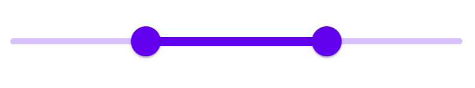
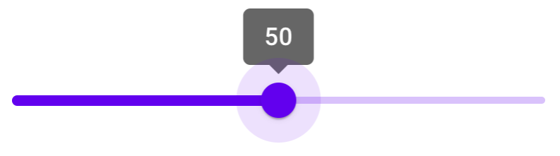
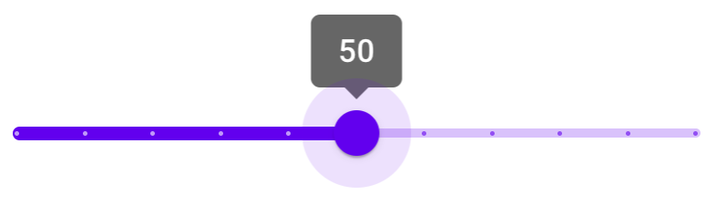

<!--docs:
title: "Sliders"
layout: detail
section: components
excerpt: "Sliders allow users to make selections from a range of values."
iconId: slider
path: /catalog/input-controls/sliders/
-->

# Slider

[Sliders](https://material.io/components/sliders/) allow users to make
selections from a range of values.

The MDC Slider implementation supports both single point sliders (one thumb)
and range sliders (two thumbs). It is backed by the browser
`<input type="range">` element, is fully accessible, and is RTL-aware.

**Contents**

*   [Using sliders](#using-sliders)
*   [Sliders](#sliders)
*   [Other variants](#other-variants)
*   [Additional information](#additional-information)
*   [API](#api)

## Using sliders

### Installing sliders

```
npm install @material/slider
```

### Styles

```scss
@use "@material/slider/styles";
```

### JavaScript instantiation

```js
import {MDCSlider} from '@material/slider';

const slider = new MDCSlider(document.querySelector('.mdc-slider'));
```

**Note**: See [Importing the JS component](../../docs/importing-js.md) for more
information on how to import JavaScript.

### Making sliders accessible

Sliders are backed by an `<input>` element, meaning that they are fully
accessible. Unlike the [ARIA-based slider](https://www.w3.org/TR/wai-aria-practices/#slider),
MDC sliders are adjustable using touch-based assistive technologies such as
TalkBack on Android.

Per the spec, ensure that the following attributes are added to the
`input` element(s):

* `value`: Value representing the current value.
* `min`: Value representing the minimum allowed value.
* `max`: Value representing the maximum allowed value.
* `aria-label` or `aria-labelledby`: Accessible label for the slider.

If the value is not user-friendly (e.g. a number to
represent the day of the week), also set the following:

* `aria-valuetext`: Set this input attribute to a string that makes the slider
value understandable, e.g. 'Monday'.
* Add a function to map the slider value to `aria-valuetext` via the
`MDCSlider#setValueToAriaValueTextFn` method.

## Sliders

There are two types of sliders:

1.  [Continuous slider](#continuous-slider)
1.  [Discrete slider](#discrete-slider)

### Continuous slider

Continuous sliders allow users to make meaningful selections that don’t require
a specific value.

Note: The step size for value quantization is, by default, 1. To specify
a custom step size, provide a value for the `step` attribute on the `input`
element.


```html
<div class="mdc-slider">
  <div class="mdc-slider__track">
    <div class="mdc-slider__track--inactive"></div>
    <div class="mdc-slider__track--active">
      <div class="mdc-slider__track--active_fill"></div>
    </div>
  </div>
  <div class="mdc-slider__thumb">
    <div class="mdc-slider__thumb-knob"></div>
    <input class="mdc-slider__input" type="range" min="0" max="100" value="50" name="volume" aria-label="Continuous slider demo">
  </div>
</div>
```

#### Continuous range slider

Note: By default there's no minimum distance between the two thumbs. To specify
one, provide a value for the `data-min-range` attribute on the root element and
adjust the `min` and `max` attributes on the input elements accordingly.



```html
<div class="mdc-slider mdc-slider--range" data-min-range="10">
  <div class="mdc-slider__track">
    <div class="mdc-slider__track--inactive"></div>
    <div class="mdc-slider__track--active">
      <div class="mdc-slider__track--active_fill"></div>
    </div>
  </div>
  <div class="mdc-slider__thumb">
    <div class="mdc-slider__thumb-knob"></div>
    <input class="mdc-slider__input" type="range" min="0" max="60" value="30" name="rangeStart" aria-label="Continuous range slider demo">
  </div>
  <div class="mdc-slider__thumb">
    <div class="mdc-slider__thumb-knob"></div>
    <input class="mdc-slider__input" type="range" min="40" max="100" value="70" name="rangeEnd" aria-label="Continuous range slider demo">
  </div>
</div>
```

### Discrete slider

Discrete sliders display a numeric value label upon pressing the thumb, which
allows a user to select an exact value.



To create a discrete slider, add the following:

*   `mdc-slider--discrete` class on the root element.
*   Value indicator element (`mdc-slider__value-indicator-container`), as shown
    below.

```html
<div class="mdc-slider mdc-slider--discrete">
  <div class="mdc-slider__track">
    <div class="mdc-slider__track--inactive"></div>
    <div class="mdc-slider__track--active">
      <div class="mdc-slider__track--active_fill"></div>
    </div>
  </div>
  <div class="mdc-slider__thumb">
    <div class="mdc-slider__value-indicator-container" aria-hidden="true">
      <div class="mdc-slider__value-indicator">
        <span class="mdc-slider__value-indicator-text">
          50
        </span>
      </div>
    </div>
    <div class="mdc-slider__thumb-knob"></div>
    <input class="mdc-slider__input" type="range" min="0" max="100" value="50" name="volume" step="10" aria-label="Discrete slider demo">
  </div>
</div>
```

#### Discrete slider with tick marks

Discrete sliders can optionally display tick marks. Tick marks represent
predetermined values to which the user can move the slider.



To add tick marks to a discrete slider, add the following:

*   `mdc-slider--tick-marks` class on the root element
*   `mdc-slider__tick-marks` element as a child of the `mdc-slider__track`
    element
*   `mdc-slider__tick-mark--active` and `mdc-slider__tick-mark--inactive`
    elements as children of the `mdc-slider__tick-marks` element

```html
<div class="mdc-slider mdc-slider--discrete mdc-slider--tick-marks">
  <div class="mdc-slider__track">
    <div class="mdc-slider__track--inactive"></div>
    <div class="mdc-slider__track--active">
      <div class="mdc-slider__track--active_fill"></div>
    </div>
    <div class="mdc-slider__tick-marks">
      <div class="mdc-slider__tick-mark--active"></div>
      <div class="mdc-slider__tick-mark--active"></div>
      <div class="mdc-slider__tick-mark--active"></div>
      <div class="mdc-slider__tick-mark--active"></div>
      <div class="mdc-slider__tick-mark--active"></div>
      <div class="mdc-slider__tick-mark--active"></div>
      <div class="mdc-slider__tick-mark--inactive"></div>
      <div class="mdc-slider__tick-mark--inactive"></div>
      <div class="mdc-slider__tick-mark--inactive"></div>
      <div class="mdc-slider__tick-mark--inactive"></div>
      <div class="mdc-slider__tick-mark--inactive"></div>
    </div>
  </div>
  <div class="mdc-slider__thumb">
    <div class="mdc-slider__value-indicator-container" aria-hidden="true">
      <div class="mdc-slider__value-indicator">
        <span class="mdc-slider__value-indicator-text">
          50
        </span>
      </div>
    </div>
    <div class="mdc-slider__thumb-knob"></div>
    <input class="mdc-slider__input" type="range" min="0" max="100" value="50" name="volume" step="10" aria-label="Discrete slider with tick marks demo">
  </div>
</div>
```

#### Discrete range slider

```html
<div class="mdc-slider mdc-slider--range mdc-slider--discrete">
  <div class="mdc-slider__track">
    <div class="mdc-slider__track--inactive"></div>
    <div class="mdc-slider__track--active">
      <div class="mdc-slider__track--active_fill"></div>
    </div>
  </div>
  <div class="mdc-slider__thumb">
    <div class="mdc-slider__value-indicator-container" aria-hidden="true">
      <div class="mdc-slider__value-indicator">
        <span class="mdc-slider__value-indicator-text">
          20
        </span>
      </div>
    </div>
    <div class="mdc-slider__thumb-knob"></div>
    <input class="mdc-slider__input" type="range" min="0" max="50" value="20" step="10" name="rangeStart" aria-label="Discrete range slider demo">
  </div>
  <div class="mdc-slider__thumb">
    <div class="mdc-slider__value-indicator-container" aria-hidden="true">
      <div class="mdc-slider__value-indicator">
        <span class="mdc-slider__value-indicator-text">
          50
        </span>
      </div>
    </div>
    <div class="mdc-slider__thumb-knob"></div>
    <input class="mdc-slider__input" type="range" min="20" max="100" value="50" step="10" name="rangeEnd" aria-label="Discrete range slider demo">
  </div>
</div>
```

## Other variants

### Disabled slider

To disable a slider, add the following:

*   `mdc-slider--disabled` class on the root element
*   `disabled` attribute on the input element

```html
<div class="mdc-slider mdc-slider--disabled">
  <div class="mdc-slider__track">
    <div class="mdc-slider__track--inactive"></div>
    <div class="mdc-slider__track--active">
      <div class="mdc-slider__track--active_fill"></div>
    </div>
  </div>
  <div class="mdc-slider__thumb">
    <div class="mdc-slider__thumb-knob"></div>
    <input class="mdc-slider__input" type="range" min="0" max="100" value="50" step="10" disabled name="volume" aria-label="Disabled slider demo">
  </div>
</div>
```

## Additional information

### Initialization with custom ranges and values

When `MDCSlider` is initialized, it reads the input element's `min`,
`max`, and `value` attributes if present, using them to set
the component's internal `min`, `max`, and `value` properties.

Use these attributes to initialize the slider with a custom range and values,
as shown below:

```html
<div class="mdc-slider">
  <!-- ... -->
  <div class="mdc-slider__thumb">
    <!-- ... -->
    <input class="mdc-slider__input" aria-label="Slider demo" min="0" max="100" value="75">
  </div>
</div>
```

### Setting slider position before component initialization

When `MDCSlider` is initialized, it updates the slider track and thumb
positions based on the internal value(s). To set the correct track and thumb
positions before component initialization, mark up the DOM as follows:

- Calculate `rangePercentDecimal`, the active track range as a percentage of
  the entire track, i.e. `(valueEnd - valueStart) / (max - min)`.
  Set `transform:scaleX(<rangePercentDecimal>)` as an inline style on the
  `mdc-slider__track--active_fill` element.
- Calculate `thumbEndPercent`, the initial position of the end thumb as a
  percentage of the entire track. Set `left:calc(<thumbEndPercent>% - 24px)`
  as an inline style on the end thumb (`mdc-slider__thumb`) element
  (or `right` for RTL layouts).
- *[Range sliders only]* Calculate `thumbStartPercent`, the initial position
  of the start thumb as a percentage of the entire track. Set
  `left:calc(<thumbStartPercent>% - 24px)` as an inline style on the
  start thumb (`mdc-slider__thumb`) element (or `right` for RTL layouts).
- *[Range sliders only]* Using the previously calculated `thumbStartPercent`,
  set `left:<thumbStartPercent>%` as an inline style on the
  `mdc-slider__track--active_fill` element (or `right` for RTL layouts).

Additionally, the MDCSlider component should be initialized with
`skipInitialUIUpdate` set to true.

#### Range slider example

This is an example of a range slider with internal values of
`[min, max] = [0, 100]` and `[start, end] = [30, 70]`, and a minimum range of
10.

```html
<div class="mdc-slider mdc-slider--range" data-min-range="10">
  <div class="mdc-slider__track">
    <div class="mdc-slider__track--inactive"></div>
    <div class="mdc-slider__track--active">
      <div class="mdc-slider__track--active_fill"
           style="transform:scaleX(.4); left:30%"></div>
    </div>
  </div>
  <div class="mdc-slider__thumb" style="left:calc(30%-24px)">
    <div class="mdc-slider__thumb-knob"></div>
    <input class="mdc-slider__input" type="range" min="0" max="60" value="30" name="rangeStart" aria-label="Range slider demo">
  </div>
  <div class="mdc-slider__thumb" style="left:calc(70%-24px)">
    <div class="mdc-slider__thumb-knob"></div>
    <input class="mdc-slider__input" type="range" min="40" max="100" value="70" name="rangeEnd" aria-label="Range slider demo">
  </div>
</div>
```

## API

### Sass mixins

Mixin | Description
--- | ---
`track-active-color($color)` | Sets the color of the active track.
`track-inactive-color($color, $opacity)` | Sets the color and opacity of the inactive track.
`thumb-color($color)` | Sets the color of the thumb.
`thumb-ripple-color($color)` | Sets the color of the thumb ripple.
`tick-mark-active-color($color)` | Sets the color of tick marks on the active track.
`tick-mark-inactive-color($color)` | Sets the color of tick marks on the inactive track.
`value-indicator-color($color, $opaicty)` | Sets the color and opacity of the value indicator.
`value-indicator-text-color($color, $opaicty)` | Sets the color of the value indicator text.

### `MDCSlider` events

Event name | `event.detail` | Description
--- | --- | ---
`MDCSlider:change` | `MDCSliderChangeEventDetail` | Emitted when a value has been changed and committed from a user event. Mirrors the native `change` event: https://developer.mozilla.org/en-US/docs/Web/API/HTMLElement/change_event
`MDCSlider:input` | `MDCSliderChangeEventDetail` | Emitted when a value has been changed from a user event. Mirrors the native `input` event: https://developer.mozilla.org/en-US/docs/Web/API/HTMLElement/input_event

### `MDCSlider` methods

Method Signature | Description
--- | ---
`getValueStart() => number` | Gets the value of the start thumb (only applicable for range sliders).
`setValueStart(valueStart: number) => void` | Sets the value of the start thumb (only applicable for range sliders).
`getValue() => number` | Gets the value of the thumb (for single point sliders), or the end thumb (for range sliders).
`setValue(value: number) => void` | Sets the value of the thumb (for single point sliders), or the end thumb (for range sliders).
`getDisabled() => boolean` | Gets the disabled state of the slider.
`setDisabled(disabled: boolean) => void` | Sets the disabled state of the slider.
`setValueToAriaValueTextFn((mapFn: ((value: number) => string) \| null) => void` | Sets a function that maps the slider value to value of the `aria-valuetext` attribute on the thumb element. If not set, the `aria-valuetext` attribute is unchanged when the value changes.

### Usage within frameworks

If you are using a JavaScript framework such as React or Angular, you can create a slider for your framework. Depending on your needs, you can use the _Simple Approach: Wrapping MDC Web Vanilla Components_, or the _Advanced Approach: Using Foundations and Adapters_. Please follow the instructions [here](../../docs/integrating-into-frameworks.md).

See [MDCSliderAdapter](./adapter.ts) and [MDCSliderFoundation](./foundation.ts) for up-to-date code documentation of slider foundation API's.
