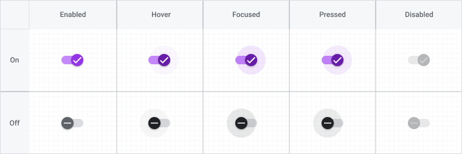

<!--docs:
title: "Switches"
layout: detail
section: components
iconId: switch
path: /catalog/input-controls/switches/
-->

# Selection controls: switches

[Selection controls](https://material.io/components/selection-controls#usage) allow the user to select options.

Switches toggle the state of a single setting on or off. They are the preferred way to adjust settings on mobile.


**Contents**

* [Using switches](#using-switches)
* [Switches](#switches)
* [Other variants](#other-variants)
* [API](#api)
* [Usage within web frameworks](#usage-within-web-frameworks)

## Using switches

Use switches to:

* Toggle a single item on or off, on mobile and tablet
* Immediately activate or deactivate something

### Installing switches

```
npm install @material/switch
```

### Styles

```scss
@use "@material/switch";

@include switch.core-styles;
```

### JavaScript instantiation

The switch requires JavaScript to function, so it is necessary to instantiate `MDCSwitch` on the `mdc-switch` element.

```js
import {MDCSwitch} from '@material/switch';

const switchControl = new MDCSwitch(document.querySelector('.mdc-switch'));
```

**Note: See [Importing the JS component](../../docs/importing-js.md) for more information on how to import JavaScript.**

## Switches

### Switch example

```html
<div class="mdc-switch">
  <div class="mdc-switch__track"></div>
  <div class="mdc-switch__thumb-underlay">
    <div class="mdc-switch__thumb"></div>
    <input type="checkbox" id="basic-switch" class="mdc-switch__native-control" role="switch" aria-checked="false">
  </div>
</div>
<label for="basic-switch">off/on</label>
```

### Switch states

Switches can be on or off. Switches have enabled, hover, focused, and pressed states.



## Other variants

### Initially disabled switch

Add the `mdc-switch--disabled` class to the `mdc-switch` element, and the `disabled` attribute to the `mdc-switch__native-control` element to disable the switch. This logic is handled by the `MDCSwitchFoundation.setDisabled` method, but you'll want to avoid a FOUC by initially adding this class and attribute.

```html
<div class="mdc-switch mdc-switch--disabled">
  <div class="mdc-switch__track"></div>
  <div class="mdc-switch__thumb-underlay">
    <div class="mdc-switch__thumb"></div>
    <input type="checkbox" id="another-basic-switch" class="mdc-switch__native-control" role="switch" aria-checked="false" disabled>
  </div>
</div>
<label for="another-basic-switch">off/on</label>
```

### Initially "on" switch

Add the `mdc-switch--checked` class to the `mdc-switch` element, and the `checked` attribute to the `mdc-switch__native-control` element to toggle the switch to "on". This logic is handled by the `MDCSwitchFoundation.setChecked` method, but you'll want to avoid a FOUC by initially adding this class and attribute.

```html
<div class="mdc-switch mdc-switch--checked">
  <div class="mdc-switch__track"></div>
  <div class="mdc-switch__thumb-underlay">
    <div class="mdc-switch__thumb"></div>
    <input type="checkbox" id="another-basic-switch" class="mdc-switch__native-control" role="switch" aria-checked="true" checked>
  </div>
</div>
<label for="another-basic-switch">off/on</label>
```

## API

### CSS classes

CSS Class | Description
--- | ---
`mdc-switch` | Mandatory, for the parent element.
`mdc-switch--disabled` | Optional, styles the switch as disabled
`mdc-switch--checked` | Optional, styles the switch as checked ("on")
`mdc-switch__track` | Mandatory, for the track element.
`mdc-switch__thumb-underlay` | Mandatory, for the ripple effect.
`mdc-switch__thumb` | Mandatory, for the thumb element.
`mdc-switch__native-control` | Mandatory, for the hidden input checkbox.

### Sass mixins

MDC Switch uses [MDC Theme](../mdc-theme)'s `secondary` color by default for the checked (toggled on) state.
Use the following mixins to customize _enabled_ switches. It is not currently possible to customize the color of a
 _disabled_ switch. Disabled switches use the same colors as enabled switches, but with a different opacity value.

Mixin | Description
--- | ---
`toggled-on-color($color)` | Sets the base color of the track, thumb, and ripple when the switch is toggled on.
`toggled-off-color($color)` | Sets the base color of the track, thumb, and ripple when the switch is toggled off.
`toggled-on-track-color($color)` | Sets color of the track when the switch is toggled on.
`toggled-off-track-color($color)` | Sets color of the track when the switch is toggled off.
`toggled-on-thumb-color($color)` | Sets color of the thumb when the switch is toggled on.
`toggled-off-thumb-color($color)` | Sets color of the thumb when the switch is toggled off.
`toggled-on-ripple-color($color)` | Sets the color of the ripple surrounding the thumb when the switch is toggled on.
`toggled-off-ripple-color($color)` | Sets the color of the ripple surrounding the thumb when the switch is toggled off.
`ripple-size($ripple-size)` | Sets the ripple size of the switch.
`density($density-scale)` | Sets density scale for switch. Supported density scales are `-5`, `-4`, `-3`, `-2`, `-1`, and `0` (default).
`ripple-states-opacity($opacity-map)` | Sets the opacity of the ripple surrounding the thumb in any of the `hover`, `focus`, or `press` states. The `opacity-map` can specify any of these states as keys. States not specified in the map resort to default opacity values.

### `MDCSwitch` properties and methods

Property | Value Type | Description
--- | --- | ---
`checked` | Boolean | Setter/getter for the switch's checked state
`disabled` | Boolean | Setter/getter for the switch's disabled state

## Usage within web frameworks

If you are using a JavaScript framework, such as React or Angular, you can create a Switch for your framework. Depending on your needs, you can use the _Simple Approach: Wrapping MDC Web Vanilla Components_, or the _Advanced Approach: Using Foundations and Adapters_. Please follow the instructions [here](../../docs/integrating-into-frameworks.md).

### `MDCSwitchAdapter`

| Method Signature | Description |
| --- | --- |
| `addClass(className: string) => void` | Adds a class to the root element. |
| `removeClass(className: string) => void` | Removes a class from the root element. |
| `setNativeControlChecked(checked: boolean)` | Sets the checked state of the native control. |
| `setNativeControlDisabled(disabled: boolean)` | Sets the disabled state of the native control. |
| `setNativeControlAttr(attr: string, value: string)` | Sets an HTML attribute to the given value on the native input element. |

### `MDCSwitchFoundation`

| Method Signature | Description |
| --- | --- |
| `setChecked(checked: boolean) => void` | Sets the checked value of the native control and updates styling to reflect the checked state. |
| `setDisabled(disabled: boolean) => void` | Sets the disabled value of the native control and updates styling to reflect the disabled state. |
| `handleChange(evt: Event) => void` | Handles a change event from the native control. |

### `MDCSwitchFoundation` event handlers

If wrapping the switch component it is necessary to add an event handler for native control change events that calls the `handleChange` foundation method. For an example of this, see the [`MDCSwitch`](component.ts) component's `initialSyncWithDOM` method.

| Event | Element Selector | Foundation Handler |
| --- | --- | --- |
| `change` | `.mdc-switch__native-control` | `handleChange()` |
