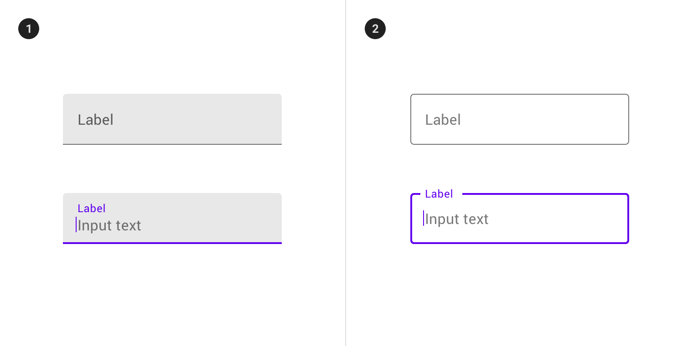

<!--docs:
title: "Text field"
layout: detail
section: components
excerpt: "MDC Web text field"
iconId: text_field
path: /catalog/input-controls/text-field/
-->

# Text field

[Text fields](https://material.io/components/text-fields) let users enter and edit text.

For more information, see the [API](#api) documentation.

The text field class consists of the following types:

* [Filled text](#filled-text)
* [Outlined text](#outlined-text)



## Using text fields

Text fields allow users to enter text into a UI. They typically appear in forms and dialogs.

### Installation

```
npm install @material/textfield
```

### Styles

```scss
@use "@material/textfield";

@include textfield.core-styles;
```

### JavaScript instantiation

```js
import {MDCTextField} from '@material/textfield';

const textField = new MDCTextField(document.querySelector('.mdc-text-field'));
```

**Note: See [Importing the JS component](../../docs/importing-js.md) for more information on how to import JavaScript.**

## Filled text

[Filled text fields](https://material.io/components/text-fields/#filled-text-field) have more visual emphasis than outlined text fields, making them stand out when surrounded by other content and components.

### Filled text example

```html
<label class="mdc-text-field mdc-text-field--filled">
  <span class="mdc-text-field__ripple"></span>
  <input class="mdc-text-field__input" type="text" aria-labelledby="my-label-id">
  <span class="mdc-floating-label" id="my-label-id">Hint text</span>
  <span class="mdc-line-ripple"></span>
</label>
```

## Outlined text

[Outlined text fields](https://material.io/components/text-fields/#outlined-text-field) have less visual emphasis than filled text fields. When they appear in places like forms, where many text fields are placed together, their reduced emphasis helps simplify the layout.

### Outlined text example

```html
<label class="mdc-text-field mdc-text-field--outlined">
  <input type="text" class="mdc-text-field__input" aria-labelledby="my-label-id">
  <span class="mdc-notched-outline">
    <span class="mdc-notched-outline__leading"></span>
    <span class="mdc-notched-outline__notch">
      <span class="mdc-floating-label" id="my-label-id">Your Name</span>
    </span>
    <span class="mdc-notched-outline__trailing"></span>
  </span>
</label>
```

See [here](../mdc-notched-outline/) for more information on using the notched outline sub-component.

**Note: Do not use `mdc-line-ripple` inside of `mdc-text-field` _if you plan on using `mdc-text-field--outlined`_. Line Ripple should not be included as part of the DOM structure of an outlined text field.**

## Other variations

### Full width

Full width text fields are useful for in-depth tasks or entering complex information.

```html
<label class="mdc-text-field mdc-text-field--filled mdc-text-field--fullwidth">
  <span class="mdc-text-field__ripple"></span>
  <input class="mdc-text-field__input"
         type="text"
         placeholder="Full-Width Text Field"
         aria-label="Full-Width Text Field">
  <span class="mdc-line-ripple"></span>
</label>
```

**Note: Do not use `mdc-text-field--outlined` to style a full width text field.**

**Note: Do not use `mdc-floating-label` within `mdc-text-field--fullwidth`. Labels should not be
included as part of the DOM structure of a full width text field.**

### Textarea

```html
<label class="mdc-text-field mdc-text-field--outlined mdc-text-field--textarea mdc-text-field--no-label">
  <textarea class="mdc-text-field__input" rows="8" cols="40" aria-label="Label"></textarea>
  <span class="mdc-notched-outline">
    <span class="mdc-notched-outline__leading"></span>
    <span class="mdc-notched-outline__trailing"></span>
  </span>
</label>
```

**Note: Only the `mdc-text-field--outlined` variant of textarea is currently supported.**

### Text field without label

A text field doesn’t require a label if a separate but clear label indicator is already displayed adjacent to the text field.
Add class name `mdc-text-field--no-label` and remove the label element from the structure.

#### Filled

```html
<label class="mdc-text-field mdc-text-field--filled mdc-text-field--no-label">
  <span class="mdc-text-field__ripple"></span>
  <input class="mdc-text-field__input" type="text" placeholder="Placeholder text" aria-label="Label">
  <span class="mdc-line-ripple"></span>
</label>
```

#### Outlined

```html
<label class="mdc-text-field mdc-text-field--outlined mdc-text-field--no-label">
  <input class="mdc-text-field__input" type="text" aria-label="Label">
  <span class="mdc-notched-outline">
    <span class="mdc-notched-outline__leading"></span>
    <span class="mdc-notched-outline__trailing"></span>
  </span>
</label>
```

#### Textarea

```html
<label class="mdc-text-field mdc-text-field--outlined mdc-text-field--textarea mdc-text-field--no-label">
  <textarea class="mdc-text-field__input" rows="8" cols="40" aria-label="Label"></textarea>
  <span class="mdc-notched-outline">
    <span class="mdc-notched-outline__leading"></span>
    <span class="mdc-notched-outline__trailing"></span>
  </span>
</label>
```

### Disabled text field

To disable the text field, add the `disabled` attribute to the `<input>` element and add the `mdc-text-field--disabled` class to the `mdc-text-field` element.

```html
<label class="mdc-text-field mdc-text-field--filled mdc-text-field--disabled">
  <span class="mdc-text-field__ripple"></span>
  <input class="mdc-text-field__input" type="text" aria-labelledby="my-label-id" disabled>
  <span class="mdc-floating-label" id="my-label-id">Disabled text field</span>
  <span class="mdc-line-ripple"></span>
</label>
```

### Text field with helper text

The helper text provides supplemental information and/or validation messages to users. It appears on input field focus
and disappears on input field blur by default, or it can be persistent. Helper text should be rendered inside `.mdc-text-field-helper-line` element
which is immediate sibling of `.mdc-text-field`. See [here](helper-text/) for more information on using helper text.

```html
<label class="mdc-text-field mdc-text-field--filled">
  <span class="mdc-text-field__ripple"></span>
  <input class="mdc-text-field__input" type="text"
         aria-labelledby="my-label-id"
         aria-controls="my-helper-id"
         aria-describedby="my-helper-id">
  <span class="mdc-floating-label" id="my-label-id">My Label</span>
  <span class="mdc-line-ripple"></span>
</label>
<div class="mdc-text-field-helper-line">
  <div class="mdc-text-field-helper-text" id="my-helper-id" aria-hidden="true">helper text</div>
</div>
```

### Text field with character counter

Character counter is used if there is a character limit. It displays the ratio of characters used and the total character limit.
Character counter should be rendered inside `.mdc-text-field-helper-line` element which is immediate sibling of `.mdc-text-field`.
See [here](character-counter/) for more information on using character counter.

```html
<label class="mdc-text-field mdc-text-field--filled">
  <span class="mdc-text-field__ripple"></span>
  <input class="mdc-text-field__input" type="text" aria-labelledby="my-label-id" maxlength="10">
  <span class="mdc-floating-label" id="my-label-id">My Label</span>
  <span class="mdc-line-ripple"></span>
</label>
<div class="mdc-text-field-helper-line">
  <div class="mdc-text-field-character-counter">0 / 10</div>
</div>
```

### Multi-line text field (textarea) with character counter

A character counter can be associated with a textarea by including it in the
helper line. In this case, the counter will appear below the textarea, adjacent
to any helper text.

```html
<label class="mdc-text-field mdc-text-field--textarea">
  <textarea class="mdc-text-field__input" aria-labelledby="my-label-id" rows="8"
    cols="40" maxlength="140"></textarea>
  <span class="mdc-notched-outline">
    <span class="mdc-notched-outline__leading"></span>
    <span class="mdc-notched-outline__notch">
      <span class="mdc-floating-label" id="my-label-id">Textarea Label</span>
    </span>
    <span class="mdc-notched-outline__trailing"></span>
  </span>
</label>
<div class="mdc-text-field-helper-line">
  <div class="mdc-text-field-character-counter">0 / 140</div>
</div>
```
Alternatively, the character counter can be placed in the textarea's body by
inserting the character counter at the top of the textarea container.

```html
<label class="mdc-text-field mdc-text-field--outlined mdc-text-field--textarea">
  <div class="mdc-text-field-character-counter">0 / 140</div>
  <textarea class="mdc-text-field__input" aria-labelledby="my-label-id" rows="8" cols="40" maxlength="140"></textarea>
  <span class="mdc-notched-outline">
    <span class="mdc-notched-outline__leading"></span>
    <span class="mdc-notched-outline__notch">
      <span class="mdc-floating-label" id="my-label-id">Textarea Label</span>
    </span>
    <span class="mdc-notched-outline__trailing"></span>
  </span>
</label>
```

Helper text and Character counter are optional subcomponents of text field that can co-exist independently.
It is recommended that `.mdc-text-field` and `.mdc-text-field-helper-line` elements have same width for correct layout.

### Text field with prefix and suffix text

Prefix and suffix text can add context to a text field, such as a currency symbol prefix or a unit of mass suffix.
A prefix, suffix, or both can be added within the default or outlined variants of text fields.

```html
<label class="mdc-text-field mdc-text-field--filled">
  <span class="mdc-text-field__ripple"></span>
  <span class="mdc-text-field__affix mdc-text-field__affix--prefix">$</span>
  <input class="mdc-text-field__input" type="text" aria-labelledby="my-label-id">
  <span class="mdc-text-field__affix mdc-text-field__affix--suffix">.00</span>
  <span class="mdc-floating-label" id="my-label-id">Currency Value</span>
  <span class="mdc-line-ripple"></span>
</label>
```

**Note: Do not use `mdc-text-field--affix` within `mdc-text-field--textarea`.**

### Text field with leading and trailing icons

Leading and trailing icons can be added within the default or outlined variant of MDC Text Field as visual indicators as
well as interaction targets. See [here](icon/) for more information on using icons.

## Other features

### HTML5 validation

`MDCTextFieldFoundation` provides validity styling by using the `:invalid` and `:required` attributes provided
by HTML5's form validation API.

```html
<label class="mdc-text-field mdc-text-field--filled">
  <span class="mdc-text-field__ripple"></span>
  <input class="mdc-text-field__input" type="password" aria-labelledby="my-label-id" required minlength="8">
  <span class="mdc-floating-label" id="my-label-id">Password</span>
  <span class="mdc-line-ripple"></span>
</label>
```

`MDCTextFieldFoundation` automatically appends an asterisk to the label text if the required attribute is set.

### Pre-filled

When dealing with JS-driven text fields that already have values, you'll want to ensure that you
render `mdc-text-field` with the `mdc-text-field--label-floating` modifier class, as well as
`mdc-floating-label` with the `mdc-floating-label--float-above` modifier class. This will
ensure that the label moves out of the way of the text field's value and prevents a Flash Of
Un-styled Content (**FOUC**).

```html
<label class="mdc-text-field mdc-text-field--filled mdc-text-field--label-floating">
  <span class="mdc-text-field__ripple"></span>
  <input class="mdc-text-field__input" type="text" aria-labelledby="my-label-id" value="Pre-filled value">
  <span class="mdc-floating-label mdc-floating-label--float-above" id="my-label-id">
    Label in correct place
  </span>
  <span class="mdc-line-ripple"></span>
</label>
```

### Baseline alignment

By default, text fields will be aligned with other elements relative to their
baseline. The input text's baseline is used to determine where a text field
should be aligned to and is different between variants. To force alignment to
the text field's container instead of its baseline, align the element using
flexbox.

```html
<div>
  <label class="mdc-text-field mdc-text-field--outlined">
    <input type="text" class="mdc-text-field__input" value="Baseline">
    <span class="mdc-notched-outline__leading"></span>
    <span class="mdc-notched-outline__trailing"></span>
  </label>
  <span>Text that is aligned with the text field's value</span>
</div>

<div style="display: flex; flex-direction: row; align-items: flex-end;">
  <label class="mdc-text-field mdc-text-field--outlined">
    <input type="text" class="mdc-text-field__input" value="Baseline">
    <span class="mdc-notched-outline__leading"></span>
    <span class="mdc-notched-outline__trailing"></span>
  </label>
  <span>Text that is aligned to the bottom of the text field's outline</span>
</div>
```

## API

### CSS classes

CSS Class | Description
--- | ---
`mdc-text-field` | Mandatory.
`mdc-text-field--filled` | Styles the text field as a filled text field.
`mdc-text-field--outlined` | Styles the text field as an outlined text field.
`mdc-text-field--fullwidth` | Styles the text field as a full width text field.
`mdc-text-field--textarea` | Indicates the text field is a `<textarea>`.
`mdc-text-field--disabled` | Styles the text field as a disabled text field.
`mdc-text-field--with-leading-icon` | Styles the text field as a text field with a leading icon.
`mdc-text-field--with-trailing-icon` | Styles the text field as a text field with a trailing icon.
`mdc-text-field--focused` | Styles the text field as a text field in focus.
`mdc-text-field--no-label` | Styles the text field that has no label.
`mdc-text-field--end-aligned` | Styles the text field with an end-aligned input.
`mdc-text-field--label-floating` | Styles the text field with a floating label and pre-filled or focused value.
`mdc-text-field--ltr-text` | Styles the text field's text elements (input, prefix, and suffix) as LTR even when the direction is RTL. Useful for RTL languages that use LTR for fractional notations.
`mdc-text-field-helper-line` | Styles the container of helper text and character counter elements.

### Sass mixins

To customize the colors of any part of the text-field, use the following mixins. We recommend you apply
these mixins within CSS selectors like `.foo-text-field:not(.mdc-text-field--focused)` to select your unfocused text fields,
and `.foo-text-field.mdc-text-field--focused` to select your focused text-fields. To change the invalid state of your text fields,
apply these mixins with CSS selectors such as `.foo-text-field.mdc-text-field--invalid`.

> _NOTE_: the `mdc-line-ripple-color` mixin should be applied from the not focused class `foo-text-field:not(.mdc-text-field--focused)`).

#### Mixins for all text fields

Mixin | Description
--- | ---
`ink-color($color)` | Customizes the color of the text entered into an enabled text field.
`placeholder-color($color)` | Customizes the color of the placeholder in an enabled text field.
`disabled-ink-color($color)` | Customizes the color of the entered text in a disabled text field.
`disabled-placeholder-color($color)` | Customizes the color of the placeholder in a disabled text field.
`label-color($color)` | Customizes the text color of the label in an enabled text field.
`disabled-label-color($color)` | Customizes the text color of the label in a disabled text field.
`caret-color($color)` | Customizes the color of the cursor caret of the text field.
`prefix-color($color)` | Customizes the color of the prefix text of an enabled text field.
`disabled-prefix-color($color)` | Customizes the color of the prefix text of a disabled text field.
`suffix-color($color)` | Customizes the color of the suffix text of an enabled text field.
`disabled-suffix-color($color)` | Customizes the color of the suffix text of a disabled text field.
`floating-label-float-transition($duration-ms, $timing-function)` | Customizes the duration and optional timing function for the floating label's "float" transition.

#### Mixins for filled text field and textarea

Mixin | Description
--- | ---
`fill-color($color)` | Customizes the background color of the text field or textarea when enabled.
`disabled-fill-color($color)` | Customizes the background color of the text field or textarea when disabled.

#### Mixins for filled text field only

Mixin | Description
--- | ---
`shape-radius($radius, $rtl-reflexive)` | Sets rounded shape to boxed text field variant with given radius size. Set `$rtl-reflexive` to true to flip radius values in RTL context, defaults to false.
`bottom-line-color($color)` | Customizes the text field bottom line color.
`hover-bottom-line-color($color)` | Customizes the hover text field bottom line color.
`disabled-bottom-line-color($color)` | Customizes the disabled text field bottom line color.
`line-ripple-color($color)` | Customizes the color of the default line ripple of the text field.
`density($density-scale)` | Sets density scale for default text field variant. Supported density scale values `-4`, `-3`, `-2`, `-1`, `0`.
`height($height)` | Sets height of default text field variant.

#### Mixins for outlined text field and textarea

Mixin | Description
--- | ---
`focused-outline-color($color)` | Customizes the outline border color when the text field or textarea is focused.
`hover-outline-color($color)` | Customizes the outline border color when the text field or textarea is hovered.
`disabled-outline-color($color)` | Customizes the outline border color when the text field or textarea is disabled.
`outline-color($color)` | Customizes the border color of the outlined text field or textarea.

#### Mixins for outlined text field only

Mixin | Description
--- | ---
`outline-shape-radius($radius, $rtl-reflexive)` | Sets rounded shape to outlined text field variant with given radius size. Set `$rtl-reflexive` to true to flip radius values in RTL context, defaults to false.
`outlined-density($density-scale)` | Sets density scale for outlined text field (Excluding outlined text field with leading icon). Supported density scale values `-4`, `-3`, `-2`, `-1`, `0`.
`outlined-height($height)` | Sets height of outlined text field variant (Excluding outlined text field with leading icon).
`outlined-with-leading-icon-density($density-scale)` | Sets density scale for outlined text field with leading icon. Supported density scale values `-4`, `-3`, `-2`, `-1`, `0`.
`outlined-with-leading-icon-height($height)` | Sets height of outlined text field with leading icon variant.

#### Mixins for textarea only

Mixin | Description
--- | ---
`textarea-shape-radius($radius, $rtl-reflexive)` | Sets rounded shape to text area variant with given radius size. Set `$rtl-reflexive` to true to flip radius values in RTL context, defaults to false.

## `MDCTextField` properties and methods

Property | Value Type | Description
--- | --- | ---
`value` | `string` | Proxies to the foundation's `getValue`/`setValue` methods.
`disabled` | `boolean` | Proxies to the foundation's `isDisabled`/`setDisabled` methods.
`useNativeValidation` | `boolean` (write-only) | Proxies to the foundation's `setUseNativeValidation` method.
`valid` | `boolean` | Proxies to the foundation's `isValid`/`setValid` methods.
`helperTextContent` | `string` (write-only)| Proxies to the foundation's `setHelperTextContent` method when set.
`ripple` | `MDCRipple` (write-only) | The `MDCRipple` instance for the root element that `MDCTextField` initializes; this only applies to the default Text Field, and is `null` for other variants.
`leadingIconAriaLabel` | `string` (write-only) | Proxies to the foundation's `setLeadingIconAriaLabel` method.
`trailingIconAriaLabel` | `string` (write-only) | Proxies to the foundation's `setTrailingIconAriaLabel` method.
`leadingIconContent` | `string` (write-only) | Proxies to the foundation's `setLeadingIconContent` method.
`trailingIconContent` | `string` (write-only) | Proxies to the foundation's `setTrailingIconContent` method.
`prefixText` | `string` | Gets or sets the text content of the prefix, if it exists.
`suffixText` | `string` | Gets or sets the text content of the suffix, if it exists.

In addition to the above, the following properties proxy to the `input` element's properties of the same name:

* `required`
* `pattern`
* `minLength`
* `maxLength`
* `min`
* `max`
* `step`

Method Signature | Description
--- | ---
`focus() => void` | Focuses the `input` or `textarea` element.
`layout() => void` | Adjusts the dimensions and positions for all sub-elements.

## Usage within frameworks

If you are using a JavaScript framework, such as React or Angular, you can create a Text Field for your framework. Depending on your needs, you can use the _Simple Approach: Wrapping MDC Web Vanilla Components_, or the _Advanced Approach: Using Foundations and Adapters_. Please follow the instructions [here](../../docs/integrating-into-frameworks.md).

### `MDCTextFieldAdapter`

Method Signature | Description
--- | ---
`addClass(className: string) => void` | Adds a class to the root element.
`removeClass(className: string) => void` | Removes a class from the root element.
`hasClass(className: string) => boolean` | Returns true if the root element contains the given class name.
`registerTextFieldInteractionHandler(evtType: string, handler: EventListener) => void` | Registers an event handler on the root element for a given event.
`deregisterTextFieldInteractionHandler(evtType: string, handler: EventListener) => void` | Deregisters an event handler on the root element for a given event.
`registerInputInteractionHandler(evtType: string, handler: EventListener) => void` | Registers an event listener on the native input element for a given event.
`deregisterInputInteractionHandler(evtType: string, handler: EventListener) => void` | Deregisters an event listener on the native input element for a given event.
`registerValidationAttributeChangeHandler(handler: (attributeNames: string[]) => void) => MutationObserver` | Registers a validation attribute change listener on the input element. Handler accepts list of attribute changes.
`deregisterValidationAttributeChangeHandler(!MutationObserver) => void` | Disconnects a validation attribute observer on the input element.
`getNativeInput() => NativeInputType \| null` | Returns an object representing the native text input element, with a similar API shape. See [types.ts](types.ts).
`isFocused() => boolean` | Returns whether the input is focused.
`shakeLabel(shouldShake: boolean) => void` | Shakes the label to indicate an invalid input value.
`floatLabel(shouldFloat: boolean) => void` | Floats the label.
`hasLabel() => boolean` | Determines whether the text field has a label element.
`getLabelWidth() => number` | Returns the width of the label element in px.
`activateLineRipple() => void` | Activates the text field's line ripple sub-element.
`deactivateLineRipple() => void` | Deactivate the text field's line ripple sub-element.
`setLineRippleTransformOrigin(normalizedX: number) => void` | Sets the CSS `transform-origin` property to the given value on the text field's line ripple sub-element (if present).
`hasOutline() => boolean` | Determines whether the text field has an outline sub-element.
`notchOutline(labelWidth: number) => void` | Sets the width of the text field's notched outline sub-element.
`closeOutline() => void` | Closes the text field's notched outline sub-element.

#### `MDCTextFieldAdapter.getNativeInput()`

Returns an object representing the native text input element, with a similar API shape. We _never_ alter the value within our code, however we _do_ update the disabled property, so if you choose to duck-type the return value for this method in your implementation it's important to keep this in mind. Also note that this method can return null, which the foundation will handle gracefully.

#### `MDCTextFieldAdapter.getIdleOutlineStyleValue(propertyName: string)`

Returns the idle outline element's computed style value of the given css property `propertyName`. The vanilla implementation achieves this via `getComputedStyle(...).getPropertyValue(propertyName)`.

### `MDCTextFieldFoundation`

Property | Value Type | Description
--- | --- | ---
`shouldFloat` | `boolean` (read-only) | Determines whether the label should float.
`shouldShake` | `boolean` (read-only) | Determines whether the label should shake.

Method Signature | Description
--- | ---
`getValue() => string` | Returns the input's value.
`setValue(value: string)` | Sets the input's value.
`setUseNativeValidation(useNativeValidation: boolean)` | Sets whether to check native HTML validity state (`true`, default) or custom validity state when updating styles (`false`).
`setValid(isValid: boolean)` | Sets custom validity and updates styles accordingly. Note that native validation will still be honored subsequently unless `setUseNativeValidation(false)` is also called.
`isValid() => boolean` | Returns the component's current validity state (either native or custom, depending on how `setUseNativeValidation()` was configured).
`isDisabled() => boolean` | Returns whether or not the input is disabled.
`setDisabled(disabled: boolean) => void` | Updates the input's disabled state.
`handleTextFieldInteraction(evt: Event) => void` | Handles click and keydown events originating from inside the Text Field component.
`handleInput() => void` | Handles text input and textarea input event.
`handleValidationAttributeChange(attributesList: !Array<string>) => void` | Handles validation attribute changes.
`activateFocus() => void` | Activates the focus state of the Text Field. Normally called in response to the input focus event.
`deactivateFocus() => void` | Deactivates the focus state of the Text Field. Normally called in response to the input blur event.
`setHelperTextContent(content: string) => void` | Sets the content of the helper text.
`setLeadingIconAriaLabel(label: string) => void` | Sets the aria label of the leading icon.
`setLeadingIconContent(content: string) => void` | Sets the text content of the leading icon.
`setTrailingIconAriaLabel(label: string) => void` | Sets the aria label of the trailing icon.
`setTrailingIconContent(content: string) => void` | Sets the text content of the trailing icon.
`notchOutline(openNotch: boolean) => void` | Opens/closes the notched outline.
`setTransformOrigin(evt: TouchEvent \| MouseEvent) => void` | Sets the line ripple's transform origin, so that the line ripple activate animation will animate out from the user's click location.
`autoCompleteFocus() => void` | Activates the Text Field's focus state in cases when the input value is changed programmatically (i.e., without user action).

`MDCTextFieldFoundation` supports multiple optional sub-elements: helper text and icon. The foundations of these sub-elements must be passed in as constructor arguments to `MDCTextFieldFoundation`.
