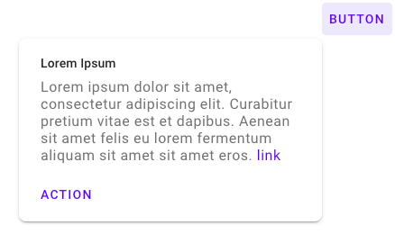
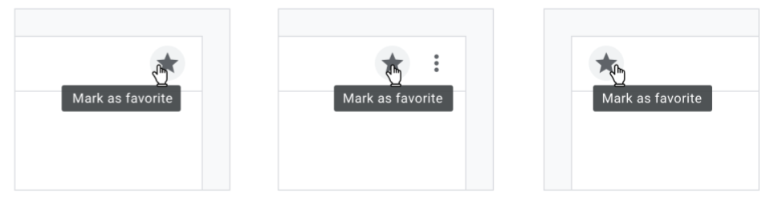
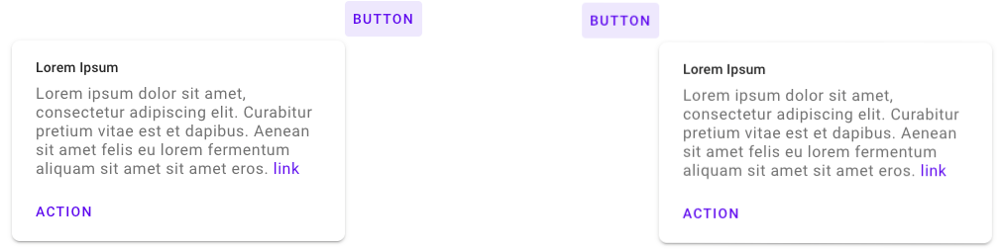

<!--docs:
title: "Tooltip"
layout: detail
section: components
excerpt: "Tooltips display informative text when users hover over, focus on, or tap an element."
iconId: tooltip
path: /catalog/tooltips/
-->

# Tooltip

Tooltips display informative text when users hover over, focus on, or tap an element.

**Contents**

* [Using tooltips](#using-tooltips)
* [Tooltips](#tooltips)
* [API](#api)
* [Usage within web frameworks](#usage-within-web-frameworks)

## Using tooltips

Plain tooltips, when activated, display a text label identifying an element, such as a
description of its function. Tooltips should include only short, descriptive
text and avoid restating visible UI text.

Common use cases include:

* Displaying full text that has been truncated
* Identifying a UI affordance
* Describing differences between similar elements
* Distinguishing actions with related iconography

Rich tooltips provide greater context and assistance for taking action through
the additions of an optional title and buttons.

Common use cases include:

* Guidance on a particular section of the page or object
* Providing informative and contextual actions

### Installing tooltips

```
npm install @material/tooltip
```

### Styles

```scss
@use "@material/tooltip/styles";
```

### JavaScript instantiation

```js
import {MDCTooltip} from '@material/tooltip';
const tooltip = new MDCTooltip(document.querySelector('.mdc-tooltip'));
```

> See [Importing the JS component](../../docs/importing-js.md) for more information on how to import JavaScript.

### Making tooltips accessible

Each tooltip element placed into the DOM is expected to have a unique `id`.
Their corresponding anchor element must be labeled with the `aria-describedby`
attribute, establishing a relationship between the two elements.

Anchor elements for rich tooltips without interactive contents (a link or an
action button), are similarly labeled with `aria-describedby`. Rich tooltips
without interactive content also have the aria-role `tooltip`.

Anchor elements for rich tooltips with interactive elements are labeled with
`data-tooltip-id`. This prevents the screen reader from announcing the contents
prior to the user navigating into the tooltip, and giving focus to the
interactive elements. Rich tooltips with interactive content have the aria-role
`dialog` instead of `tooltip` and their anchor elements has their
`aria-haspopup` property set to `dialog`, and `aria-expanded` set to the
visibility of the interactive rich tooltip.

## Tooltips

There are two types of tooltips:

 1. [Plain Tooltips](#plain-tooltips)
 1. [Rich Tooltips](#rich-tooltips)

### Plain tooltips


#### Plain tooltip example

```html
<div id="tooltip-id" class="mdc-tooltip" role="tooltip" aria-hidden="true">
  <div class="mdc-tooltip__surface">
    lorem ipsum dolor
  </div>
</div>
```

To ensure proper positioning of the tooltip, it's important that this tooltip
element is an immediate child of the `<body>`, rather than nested underneath
the anchor element or other elements.

```html
<a aria-describedby="tooltip-id" href="www.google.com"> Link </a>
```

The `aria-describedby` attribute (which is given the `id` for the associated tooltip)
designates an element as being the anchor element for a particular tooltip.

Other MDC components can be designated as anchor elements by adding this
attribute.

### Rich tooltips


Rich tooltips have two variants: default and persistent.

Default rich tooltips are shown when users hover over or focus on their anchor
element. They remain shown when users focus/hover over the contents of the rich
tooltip, but becomes hidden if the users focus/hover outside of the anchor
element or the tooltip contents. If the user clicks within the contents of the
tooltip, the tooltip will also be hidden.

Persistent rich tooltips' visibility is toggled by clicks and enter/space bar
keystrokes on their anchor element.
When shown, they remain visible when users focus/hover over the contents of the
rich tooltip, as well as when users hover outside of the anchor element or the
tooltip contents. However, they become hidden when the users focus outside of
the anchor element or the tooltip contents. If the user clicks within the
contents of the tooltip, the tooltip remains shown. If the user clicks outside
the contents of the tooltip, the tooltip will be hidden. It is recommended that
persistent rich tooltips are not added to anchor elements that already have
an click action; the click action for the anchor element should be used solely
to toggle the visibility of the rich tooltip.

#### Rich tooltip example
Default rich tooltip without interactive content

```html
<div class="mdc-tooltip-wrapper--rich">
  <button class="mdc-button" aria-describedby="tt0">
    <div class="mdc-button__ripple"></div>
    <span class="mdc-button__label">Button</span>
  </button>
  <div id="tt0" class="mdc-tooltip--rich" aria-hidden="true" role="tooltip">
     <div class="mdc-tooltip__surface">
       <p class="mdc-tooltip__content">
         Lorem ipsum dolor sit amet, consectetur adipiscing elit. Curabitur
         pretium vitae est et dapibus. Aenean sit amet felis eu lorem fermentum
         aliquam sit amet sit amet eros.
       </p>
     </div>
  </div>
</div>
```

The rich tooltip element should be a sibling of the anchor element; the anchor
and the tooltip element should be wrapped in a parent div with the class
`mdc-tooltip-wrapper--rich` or the tooltip will not be positioned correctly.

Default rich tooltip with interactive content

```html
<div class="mdc-tooltip-wrapper--rich">
  <button class="mdc-button" data-tooltip-id="tt0" aria-haspopup="dialog" aria-expanded="false">
    <div class="mdc-button__ripple"></div>
    <span class="mdc-button__label">Button</span>
  </button>
  <div id="tt0" class="mdc-tooltip--rich" aria-hidden="true" role="dialog">
     <div class="mdc-tooltip__surface">
        <h2 class="mdc-tooltip__title"> Lorem Ipsum </h2>
        <p class="mdc-tooltip__content">
          Lorem ipsum dolor sit amet, consectetur adipiscing elit. Curabitur
          pretium vitae est et dapibus. Aenean sit amet felis eu lorem fermentum
          aliquam sit amet sit amet eros.
          <a class="mdc-tooltip__content-link" href="google.com">link</a>
        </p>
        <div class="mdc-tooltip--rich-actions">
           <button class="mdc-tooltip__action" aria-label="action">
              action
           </button>
        </div>
     </div>
  </div>
</div>
```

Note that any links used within the rich tooltip has the class
`mdc-tooltip__content-link`. This is to ensure that the color of links within
rich tooltips are consistent with the color theming.

Persistent rich tooltip with interactive content

```html
<div class="mdc-tooltip-wrapper--rich">
  <button class="mdc-button" data-tooltip-id="tt0" aria-haspopup="dialog" aria-expanded="false">
    <div class="mdc-button__ripple"></div>
    <span class="mdc-button__label">Button</span>
  </button>
  <div id="tt0" class="mdc-tooltip--rich" aria-hidden="true" tabindex="-1" data-mdc-tooltip-persist="true" role="dialog">
     <div class="mdc-tooltip__surface">
        <h2 class="mdc-tooltip__title"> Lorem Ipsum </h2>
        <p class="mdc-tooltip__content">
          Lorem ipsum dolor sit amet, consectetur adipiscing elit. Curabitur
          pretium vitae est et dapibus. Aenean sit amet felis eu lorem fermentum
          aliquam sit amet sit amet eros.
          <a class="mdc-tooltip__content-link" href="google.com">link</a>
        </p>
        <div class="mdc-tooltip--rich-actions">
           <button class="mdc-tooltip__action" aria-label="action">
              action
           </button>
        </div>
     </div>
  </div>
</div>
```

Note that persistent rich tooltips have `tabindex` set to `-1`. This is added to
ensure that the tooltip is not hidden when clicked on.

#### MDC Button:

```html
<button class="mdc-button mdc-button--outlined" aria-describedby="tooltip-id">
  <div class="mdc-button__ripple"></div>
  <span class="mdc-button__label">Button</span>
</button>
```
#### MDC Icon Button:

```html
<button class="mdc-icon-button material-icons" aria-describedby="tooltip-id">favorite</button>
```

If the information provided in the tooltip is duplicated from the anchor
element's `aria-label`, the tooltip can be hidden from the screenreader by
annotating the anchor element with `data-tooltip-id` instead of
`aria-describedby`. Hiding the tooltip from the screenreader will prevent the
same information from being announced twice (once from the `aria-label` and
a second time from the tooltip). Note that rich tooltips with interactive
content already use `data-tooltip-id` instead of `aria-describedby`, and so no
change is necessary for this variant of tooltip.

```html
<button class="mdc-icon-button material-icons"
        aria-label="toggle favorite"
        data-tooltip-id="tooltip-id">
  favorite
</button>

<div id="tooltip-id" class="mdc-tooltip" role="tooltip" aria-hidden="true">
  <div class="mdc-tooltip__surface">
    toggle favorite
  </div>
</div>
```

### Tooltip positioning

Tooltip positioning is based on the anchor element.

Plain tooltips appear directly below or above this anchor element and can be
placed flush with either the end, center, or start of the anchor.


<p align="center"> *Plain tooltip aligned with the end, center, and start of an anchor element (in a LTR page flow).* </p>

Rich tooltips appear directly below or above this anchor element, and can be
placed at the corner of either the end or start of the anchor.


<p align="center"> *Rich tooltip aligned with the end and start of an anchor element (in a LTR page flow).* </p>

A threshold distance of 32px is expected to be maintained between the tooltip
and the viewport edge. A valid tooltip position is calculated based on which of
the position options (start, center, or end for x-axis alignment and above or
below for y-axis alignment) maintain this threshold. If all possible alignment
options violate the threshold, then a valid tooltip position is one that does
not collide with the viewport.

A user specified position is honored only if the specified position is
considered valid based on the logic outlined above.

## API

### Sass mixins

Access to theme mixins require importing the tooltip's theme style module.

```scss
@use "@material/tooltip";
```

Mixin | Description
--- | ---
`fill-color($color)` | Sets the fill color of the tooltip.
`label-ink-color($color)` | Sets the color of the tooltip's label text.
`rich-text-ink-color($title-color, $content-color, $content-link-color)` | Sets the color of the text for the content inside a rich tooltip.
`shape-radius($radius, $rtl-reflexive)` | Sets the rounded shape to tooltip surface with given radius size. Set `$rtl-reflexive` to true to flip radius values in RTL context, defaults to false.
`word-break($value, $fallbackValue)` | Sets the `word-break` property for the tooltip label. This is used to force-wrap long tooltip labels that lack spaces and hyphens. The optional $fallbackValue param can be used for IE11 as it does not support the `break-word` option. Users for IE11 who do not want their tooltip labels to be broken in the middle of the word can use this mixin to remove the default IE11 behavior of `break-all`.
`z-index($z-index)` | Sets the z-index of the tooltip.
`show-transition($enter-duration)` | Sets the duration for the animation that shows the tooltip.
`exit-transition($exit-duration)` | Sets the duration for the animation that hides the tooltip.

### `MDCTooltip` Methods

Method Signature | Description
--- | ---
`setTooltipPosition(position: {xPos?: XPosition, yPos?: YPosition}) => void` | Specify how the tooltip should be aligned with the anchor element. See [tooltip positioning](#tooltip-positioning) section for more information.
`setAnchorBoundaryType(type: AnchorBoundaryType) => void` | Specify whether the anchor element is `bounded` (element has an identifiable boundary such as a button) or `unbounded` (element does not have a visually declared boundary such as a text link). Tooltips are placed closer to bounded anchor elements compared to unbounded anchor elements. If no type is specified, defaults to `bounded`.
`hide() => void` | Proxies to the foundation's `hide` method, immediately hides the tooltip if it is shown.
`isShown() => boolean` | Returns whether or not the tooltip is shown.

### Usage Within Frameworks

If you are using a JavaScript framework, such as React or Angular, you can create a Tooltip for your framework. Depending on your needs, you can use the _Simple Approach: Wrapping MDC Web Vanilla Components_, or the _Advanced Approach: Using Foundations and Adapters_. Please follow the instructions [here](../../docs/integrating-into-frameworks.md).

See [MDCTooltipAdapter](./adapter.ts) and [MDCTooltipFoundation](./foundation.ts) for up-to-date code documentation of tooltip foundation APIs.
