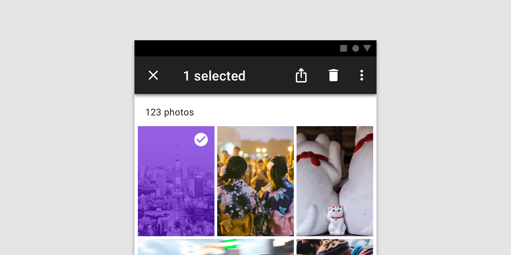

<!--docs:
title: "Top App Bar"
layout: detail
section: components
excerpt: "A container for items such as application title, navigation icon, and action items."
iconId: toolbar
path: /catalog/top-app-bar/
-->

# Top app bar

<!--<div class="article__asset">
  <a class="article__asset-link"
     href="https://material-components.github.io/material-components-web-catalog/#/component/top-app-bar">
    
  </a>
</div>-->

The top app bar provides content and actions related to the current screen. It’s used for branding, screen titles, navigation, and actions.

There are two types of top app bar:

1. [Regular top app bar](#regular-top-app-bar)
1. [Contextual action bar](#contextual-action-bar)

A regular top app bar can transform into a contextual action bar.




## Using the top app bar

### Installation

```
npm install @material/top-app-bar
```

### Styles

```scss
@use "@material/top-app-bar";
@use "@material/icon-button";

@include top-app-bar.core-styles;
@include icon-button.core-styles;
```

### JavaScript Instantiation

```js
import {MDCTopAppBar} from '@material/top-app-bar';

// Instantiation
const topAppBarElement = document.querySelector('.mdc-top-app-bar');
const topAppBar = new MDCTopAppBar(topAppBarElement);
```

**Note: See [Importing the JS component](../../docs/importing-js.md) for more information on how to import JavaScript.**

## Regular top app bar

The top app bar provides content and actions related to the current screen. It’s used for branding, screen titles, navigation, and actions.

### Regular top app bar example

```html
<header class="mdc-top-app-bar">
  <div class="mdc-top-app-bar__row">
    <section class="mdc-top-app-bar__section mdc-top-app-bar__section--align-start">
      <button class="material-icons mdc-top-app-bar__navigation-icon mdc-icon-button" aria-label="Open navigation menu">menu</button>
      <span class="mdc-top-app-bar__title">Page title</span>
    </section>
    <section class="mdc-top-app-bar__section mdc-top-app-bar__section--align-end" role="toolbar">
      <button class="material-icons mdc-top-app-bar__action-item mdc-icon-button" aria-label="Favorite">favorite</button>
      <button class="material-icons mdc-top-app-bar__action-item mdc-icon-button" aria-label="Search">search</button>
      <button class="material-icons mdc-top-app-bar__action-item mdc-icon-button" aria-label="Options">more_vert</button>
    </section>
  </div>
</header>
```

#### Menu icons

Top app bars can contain action items which are placed on the side opposite the navigation icon. You must also attach the `mdc-icon-button` class to both the `mdc-top-app-bar__navigation-icon` and the `mdc-top-app-bar__action-item` elements in order to get the correct styles applied. 

For further documentation on icons, please see the [mdc-icon-button docs](../mdc-icon-button/README.md).

## Contextual action bar

A top app bar can transform into a contextual action bar to provide contextual actions to selected items. For example, upon user selection of photos from a gallery, the top app bar transforms to a contextual app bar with actions related to the selected photos.

When a top app bar transforms into a contextual action bar, the following changes occur:

* The bar color changes
* Navigation icon is replaced with a close icon
* Top app bar title text converts to contextual action bar text
* Top app bar actions are replaced with contextual actions
* Upon closing, the contextual action bar transforms back into a top app bar.

### Contextual action bar example

The following example shows a contextual action bar with a contextual title, a close icon, two contextual action icons, and an overflow menu:

```html
<header class="mdc-top-app-bar">
  <div class="mdc-top-app-bar__row">
    <section class="mdc-top-app-bar__section mdc-top-app-bar__section--align-start">
      <button class="material-icons mdc-top-app-bar__navigation-icon mdc-icon-button" aria-label="Close">close</button>
      <span class="mdc-top-app-bar__title">Contextual title</span>
    </section>
    <section class="mdc-top-app-bar__section mdc-top-app-bar__section--align-end" role="toolbar">
      <button class="material-icons mdc-top-app-bar__action-item mdc-icon-button" aria-label="Share">share</button>
      <button class="material-icons mdc-top-app-bar__action-item mdc-icon-button" aria-label="Delete">delete</button>
      <button class="material-icons mdc-top-app-bar__action-item mdc-icon-button" aria-label="Open menu">more_vert</button>
    </section>
  </div>
</header>
````

## Other Variants

### Short

Short top app bars are top app bars that can collapse to the navigation icon side when scrolled.

```html
<header class="mdc-top-app-bar mdc-top-app-bar--short">
  <div class="mdc-top-app-bar__row">
    <section class="mdc-top-app-bar__section mdc-top-app-bar__section--align-start">
      <button class="material-icons mdc-top-app-bar__navigation-icon mdc-icon-button">menu</button>
      <span class="mdc-top-app-bar__title">Title</span>
    </section>
    <section class="mdc-top-app-bar__section mdc-top-app-bar__section--align-end" role="toolbar">
      <button class="material-icons mdc-top-app-bar__action-item mdc-icon-button" aria-label="Bookmark this page">bookmark</button>
    </section>
  </div>
</header>
```

**Note: Short top app bars should be used with no more than 1 action item.**

### Short - always closed

Short top app bars can be configured to always appear collapsed by applying the `mdc-top-app-bar--short-collapsed` before instantiating the component :

```html
<header class="mdc-top-app-bar mdc-top-app-bar--short mdc-top-app-bar--short-collapsed">
  ...
</header>
```

### Fixed

Fixed top app bars stay at the top of the page and elevate above the content when scrolled.

```html
<header class="mdc-top-app-bar mdc-top-app-bar--fixed">
  ...
</header>
```

### Prominent

The prominent top app bar is taller.

```html
<header class="mdc-top-app-bar mdc-top-app-bar--prominent">
  ...
</header>
```

### Dense

The dense top app bar is shorter.

```html
<header class="mdc-top-app-bar mdc-top-app-bar--dense">
  ...
</header>
```

## Style customization

### CSS classes

Class | Description
--- | ---
`mdc-top-app-bar` | Mandatory.
`mdc-top-app-bar--fixed` | Class used to style the top app bar as a fixed top app bar.
`mdc-top-app-bar--fixed-adjust` | Class used to style the content below the standard and fixed top app bar to prevent the top app bar from covering it.
`mdc-top-app-bar--prominent` | Class used to style the top app bar as a prominent top app bar.
`mdc-top-app-bar--prominent-fixed-adjust` | Class used to style the content below the prominent top app bar to prevent the top app bar from covering it.
`mdc-top-app-bar--dense` | Class used to style the top app bar as a dense top app bar.
`mdc-top-app-bar--dense-fixed-adjust` | Class used to style the content below the dense top app bar to prevent the top app bar from covering it.
`mdc-top-app-bar--dense-prominent-fixed-adjust` | Class used to style the content below the top app bar when styled as both dense and prominent, to prevent the top app bar from covering it.
`mdc-top-app-bar--short` | Class used to style the top app bar as a short top app bar.
`mdc-top-app-bar--short-collapsed` | Class used to indicate the short top app bar is collapsed.
`mdc-top-app-bar--short-fixed-adjust` | Class used to style the content below the short top app bar to prevent the top app bar from covering it.

### Sass mixins

Mixin | Description
--- | ---
`ink-color($color)` | Sets the ink color of the top app bar.
`icon-ink-color($color)` | Sets the ink color of the top app bar icons.
`fill-color($color)` | Sets the fill color of the top app bar.
`fill-color-accessible($color)` | Sets the fill color of the top app bar and automatically sets a high-contrast ink color.
`short-shape-radius($radius, $rtl-reflexive)` | Sets the rounded shape to short top app bar variant (when it is collapsed) with given radius size. Set `$rtl-reflexive` to true to flip radius values in RTL context, defaults to true.

## `MDCTopAppBar` properties and methods

Method Signature | Description
--- | ---
`setScrollTarget(target: element) => void` | Sets scroll target to different DOM node (default is window).

### Events

Event Name | Event Data Structure | Description
--- | --- | ---
`MDCTopAppBar:nav` | None | Emits when the navigation icon is clicked.

## Usage within web frameworks

If you are using a JavaScript framework, such as React or Angular, you can create a Top App Bar for your framework. Depending on your needs, you can use the _Simple Approach: Wrapping MDC Web Vanilla Components_, or the _Advanced Approach: Using Foundations and Adapters_. Please follow the instructions [here](../../docs/integrating-into-frameworks.md).

### `MDCTopAppBarAdapter`

Method Signature | Description
--- | ---
`addClass(className: string) => void` | Adds a class to the root element of the component.
`removeClass(className: string) => void` | Removes a class from the root element of the component.
`hasClass(className: string) => boolean` | Checks if the root element of the component has the given className.
`setStyle(property: string, value: string) => void` | Sets the specified CSS property to the given value on the root element.
`getTopAppBarHeight() => number` | Gets the height in px of the top app bar.
`getViewportScrollY() => number` | Gets the number of pixels that the content of body is scrolled from the top of the page.
`getTotalActionItems() => number` | Gets the number of action items in the top app bar.
`notifyNavigationIconClicked() => void` | Emits a custom event `MDCTopAppBar:nav` when the navigation icon is clicked.

### Foundations

#### `MDCTopAppBarBaseFoundation`, `MDCTopAppBarFoundation`, `MDCFixedTopAppBarFoundation` and `MDCShortTopAppBarFoundation`

All foundations provide the following methods:

Method Signature | Description
--- | ---
`handleTargetScroll() => void` | Handles `scroll` event on specified scrollTarget (defaults to `window`).
`handleWindowResize() => void` | Handles `resize` event on window.
`handleNavigationClick() => void` | Handles `click` event on navigation icon.

#### `MDCShortTopAppBarFoundation`

In addition to the methods above, the short variant provides the following public methods and properties:

Method Signature | Description
--- | ---
`setAlwaysCollapsed(value: boolean) => void` | When `value` is `true`, sets the short top app bar to always be collapsed.
`getAlwaysCollapsed() => boolean` | Gets if the short top app bar is in the "always collapsed" state.

Property | Value Type | Description
--- | --- | ---
`isCollapsed` | `boolean` (read-only) | Indicates whether the short top app bar is in the collapsed state.
